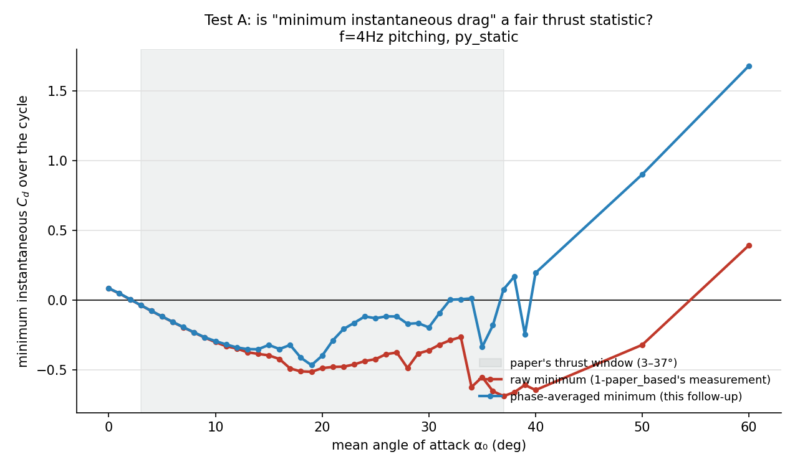
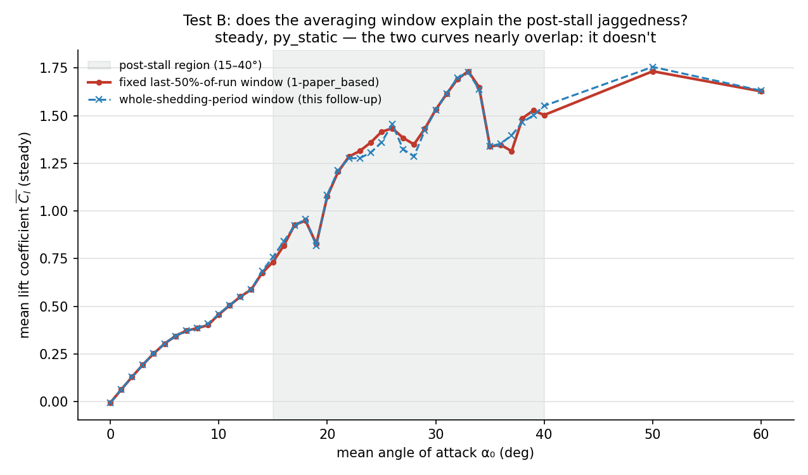
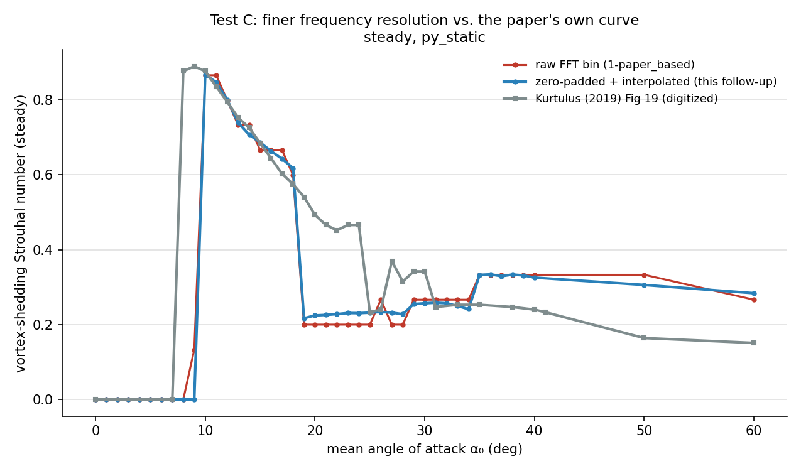
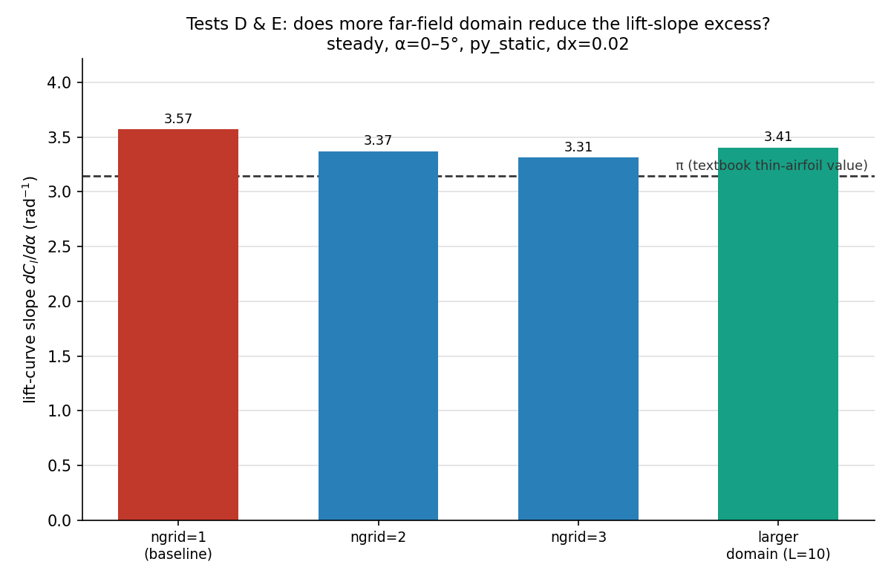
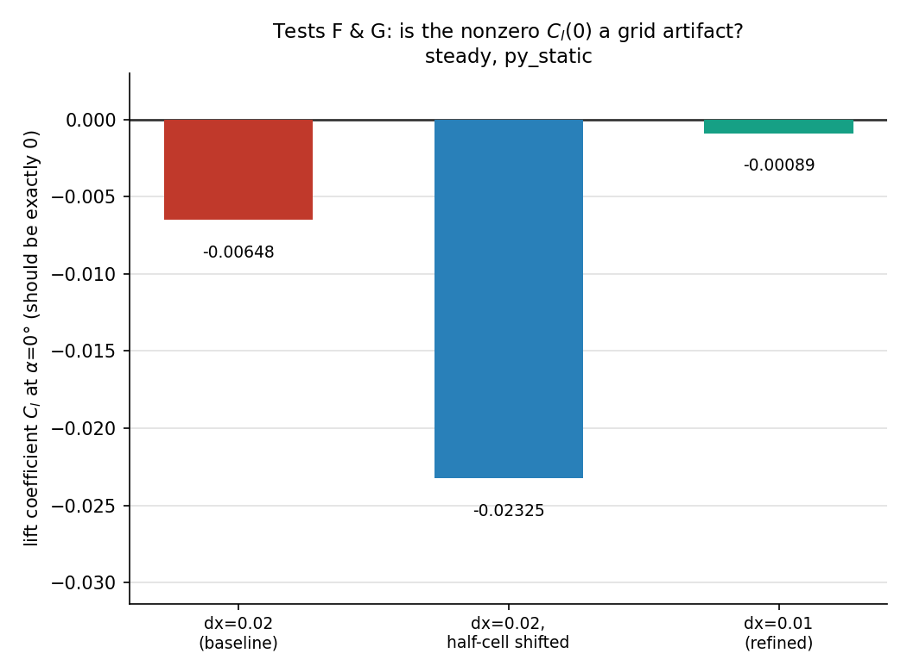

# Follow-up investigation: is it ibpm, or is it how we measured it?

## Context, for anyone jumping in cold

`kurt_comp/` reproduces the test cases from Kurtulus, D.F. (2019),
*"Unsteady aerodynamics of a pitching NACA 0012 airfoil at low Reynolds
number"* — a **numerical** (ANSYS Fluent CFD) study, not a wind-tunnel
experiment — using this repo's own immersed-boundary solver (`ibpm`), at
Re=1000, both steady and sinusoidally pitching (±1°, at 1 Hz and 4 Hz),
across mean angles of attack 0°-60°.

**[`../1-paper_based/`](../1-paper_based/)** is that main comparison: run
the full sweep, compare against Kurtulus's numbers/figures, and write up
where ibpm agrees and where it doesn't. It found four places where ibpm's
results didn't match the paper (its README calls these "Anomalies"):

1. **Thrust window too wide.** The paper says the pitching airfoil
   generates net thrust (negative drag) for mean angles 3°-37°. ibpm showed
   thrust continuing all the way out to 50°.
2. **Jagged post-stall forces.** Between 15°-40°, the paper's lift/drag
   curves rise smoothly. ibpm's curves are jagged — each 1° step gives a
   visibly different (not smoothly trending) averaged force.
3. **Vortex-shedding frequency doesn't decay smoothly.** The paper's
   shedding-frequency-vs-angle curve decays smoothly after its peak. ibpm's
   version has a stair-stepped, multi-plateau shape instead.
4. **Two small quantitative offsets**: the lift-curve slope near α=0° came
   out ~14% higher than the textbook value (π), and the lift coefficient at
   α=0° (which should be exactly 0 for a symmetric airfoil at zero angle)
   came out as a small nonzero number.

**This folder (`2-follow_up/`)** is the mentor-requested next step:
**figure out *why*, using only ibpm's own settings — no new solver, no new
method.** For each anomaly, the question is whether it's (a) a genuine
limitation of how ibpm is modeling the physics at the settings we used, or
(b) just an artifact of how we averaged/measured the output, which a
different (still standard) analysis of the exact same data would resolve.
That distinction matters because (a) tells you something true about the
solver, while (b) doesn't.

## The two kinds of test

- **"Zero new runs" (tests A, B, C)**: no new simulations at all — just
  reprocess the force-history files already sitting in
  `1-paper_based/runs/dx0.020/` with a different, still-standard analysis
  method (a more robust statistic, a different averaging window, a
  finer-resolution frequency estimate).
- **"Cheap steady runs" (tests D, E, F, G)**: new simulations, but small
  ones — steady (non-pitching) cases only, one implementation only
  (`py_static`; the two implementations were already shown to agree almost
  exactly elsewhere in this repo, so there was no need to re-check that
  here), each changing exactly one ibpm setting (far-field domain
  treatment, domain size, grid alignment, or grid resolution) to see if
  that setting explains the anomaly. 20 runs total, about half an hour of
  compute.

Regenerate everything with `python3 run_followup.py 4` (runs the 20 new
simulations; safe to re-run, it skips anything already done) followed by
`python3 analyze_followup.py` (runs all 7 tests against whatever data is on
disk, zero-new-run tests included).

## Results at a glance

| Test | Anomaly it targets | What was tried | Verdict |
|---|---|---|---|
| A | #1, thrust window too wide | Use a phase-average instead of the raw minimum instantaneous drag | **Mostly a measurement artifact** — the window shrinks back close to the paper's range |
| B | #2, jagged post-stall forces | Average over a whole number of shedding cycles instead of a fixed time window | **Not a measurement artifact** — jaggedness is a real feature of the flow at this resolution |
| C | #3, shedding-frequency plateaus | Use a finer-resolution frequency estimate (zero-padded FFT) | **Mostly NOT a measurement artifact** — raw and fine estimates are nearly identical almost everywhere (a few isolated points differ); the mismatch with the paper's curve is real and dominant |
| D | #4, lift slope 14% high | Use ibpm's own multi-domain far-field scheme (`ngrid`) instead of a single small domain | **Confirmed real limitation of our chosen settings** — using more domain levels moves the slope back toward the textbook value |
| E | #4, lift slope 14% high | Just use a bigger single domain | **Confirms D** — same improvement, different knob |
| F | #4, small nonzero Cl at α=0° | Shift the whole grid by half a cell | Confirms the offset is sensitive to exactly where the grid sits, not a real physical effect |
| G | #4, small nonzero Cl at α=0° | Refine the grid (halve the cell size) | **Confirmed: shrinks by 86%** — this is a grid-resolution artifact that goes away as the grid gets finer |

**In short: the lift-slope and α=0° offset anomalies (#4) are well
explained by the cost-saving settings the main comparison used (small
single domain, coarse grid) — they visibly improve when those settings are
turned toward accuracy. The thrust-window anomaly (#1) is mostly a
statistics issue, not a physics one. But the jagged forces (#2) and the
shedding-frequency mismatch (#3) are NOT explained away — those point to a
real, structural limitation of running this method at Re=1000 on this
grid, discussed at the end.**

## Test-by-test detail

### A. Thrust window: is "minimum instantaneous drag" a fair statistic?

The paper's claim is about drag ($C_d$) dipping below zero (thrust) for
part of each pitch cycle, for mean angles 3°-37°. `1-paper_based` measured
this as the *minimum* instantaneous drag value seen during each run. But at
high angles the flow is extremely unsteady — instantaneous drag swings
wildly — so a single minimum value can be one rare outlier spike, not
representative of the cycle as a whole.

Instead of the raw minimum, this test bins the instantaneous drag by *where
in the pitch cycle* it occurs (phase-averaging out the run-to-run noise),
then takes the minimum of that averaged curve — a much more robust
statistic for a noisy signal.



The red line (`1-paper_based`'s original measurement) stays negative
(thrust) all the way to 50°, but the blue line (this test's phase-averaged
measurement) crosses back to zero around the paper's claimed 33-37°
cutoff, shaded gray.

| Mean angle | Raw minimum drag | Phase-averaged minimum drag |
|---|---|---|
| 30° | −0.360 | −0.195 |
| 33° | −0.265 | +0.007 |
| **37°** | **−0.688 (strong "thrust")** | **+0.077 (no thrust — flips sign!)** |
| 40° | −0.645 | +0.195 |
| 50° | −0.320 | +0.902 |

At exactly the paper's claimed cutoff (37°), the phase-averaged value
actually **flips sign** compared to the raw minimum. Once outlier spikes
are averaged out, the "thrust window" closes much closer to the paper's
37° cutoff. (Full numbers: `data/thrust_window_reanalysis.csv`.)

**Conclusion**: this anomaly is mostly about *how thrust was measured*, not
a real physics disagreement — though see "what's left over" below.

### B. Jagged post-stall forces: is the averaging window to blame?

`1-paper_based` averaged forces over a fixed window (the last 50% of each
run), regardless of how many full vortex-shedding cycles that window
happened to contain. If a window cuts a cycle in half, the average can come
out skewed — which could produce exactly the kind of angle-to-angle
jumpiness seen in the anomaly.

This test instead locks the averaging window to a whole number of measured
shedding periods (using each run's own measured shedding frequency).



The two lines sit almost exactly on top of each other, including through
the jagged post-stall region (shaded gray) — visual confirmation that
changing the averaging window doesn't smooth anything out.

**Result: barely any difference.** For example at 37°, the fixed-window
average gives 1.313 and the period-locked average gives 1.397 — about a 6%
difference, similar in size to the jaggedness itself, and it doesn't
systematically smooth the curve out. (Full numbers:
`data/period_locked_mean_reanalysis.csv`.)

**Conclusion**: the averaging window is *not* the explanation. The
angle-to-angle jaggedness is a real feature — each 1° step in mean angle
genuinely produces a measurably different long-time-averaged force at this
resolution.

### C. Shedding-frequency plateaus: is this a frequency-resolution artifact?

`1-paper_based` estimated the vortex-shedding frequency from a plain FFT,
whose frequency resolution is coarse enough (~0.067 in the reported units)
to produce visible "staircase" jumps in a plot, rather than a smooth curve.

This test re-estimates the same frequency with 8x finer resolution
(zero-padding the signal before the FFT, then interpolating between the two
closest points to the peak).

**Why didn't `1-paper_based` just use finer resolution the first time?**
Not to save compute — zero-padding an FFT and interpolating the peak is
essentially free (a fraction of a second per case; it doesn't rerun the
simulation, it's pure post-processing on data that already existed). The
real reason is more mundane: `1-paper_based`'s analysis script used the FFT
output directly, without adding this refinement step, because getting a
first-pass comparison against the paper didn't call for sub-bin frequency
precision. It's worth being precise about what "finer resolution" actually
buys you here, though: **the fundamental frequency resolution of an FFT is
set by how much physical time was simulated** (a longer run naturally gives
finer bins; that part *would* cost more compute). Zero-padding doesn't add
new information beyond what's already in the existing (shorter) run — it's
a smoother, more precise *estimate* of where the peak sits given the same
data, similar to fitting a curve through a few points rather than only
reading values at those exact points. That's why it can fix the small
"staircase" artifact for free, but can't be expected to resolve anything
genuinely finer than the original run length allows.

| Angle range | Coarse estimate | Fine estimate |
|---|---|---|
| 19°-25° | flat at exactly 0.1999 | smoothly rising, 0.217 → 0.232 |
| 26°-28° | spurious jump up (0.2665 at 26°) then back down | smooth, no jump (0.234 → 0.228) |
| 35°-40° | flat at exactly 0.3331 | nearly identical, 0.326-0.334 |

**Correction:** an earlier version of this figure drew the raw-bin series
with `drawstyle="steps-mid"` (right-angle stair-step connectors between
points) while the fine series used a direct point-to-point line — two
different rendering methods for what should be a fair visual comparison.
That mismatch manufactured the appearance of a "staircase that smooths
out" across the *whole* curve, when in fact (see the regenerated figure
below, both series now drawn identically) the raw and fine estimates are
nearly coincident almost everywhere. The three numeric differences in the
table above are real (they don't depend on how the lines are drawn) but
they are isolated, narrow exceptions, not a pervasive stair-step-to-smooth
transformation. The README's former claim that "the fine stair-steps
disappear" overstated a rendering choice as a data finding — that specific
phrasing was unfounded and has been removed.



With the paper's own Fig. 19 curve now plotted alongside (gray), the real,
large-scale mismatch is directly visible rather than only inferred: the
paper's Strouhal number decays fairly continuously from its peak (~0.87 at
α≈9°) down through the 20s-60° range (with its own small local bump near
α≈27°, reaching as low as ~0.15-0.17 by α=50-60°). IBPM's curve, by
contrast, holds two distinct near-flat plateaus (≈0.20-0.23 for α=19-28°,
then ≈0.25-0.33 for α=29-60°) separated by a sharp transition, and —
notably — does **not** decay at high angles the way the paper's does
(ibpm stays ≈0.27-0.33 through α=35-60° vs. the paper's drop to
≈0.15-0.17). (Full numbers: `data/strouhal_fine_reanalysis.csv`.)

**Conclusion**: the small numeric differences between the raw and
zero-padded frequency estimates are real but minor and localized — not the
across-the-board "staircase artifact" previously described. The dominant,
unexplained effect is the large-scale mismatch with the paper's curve:
IBPM's multi-plateau shape and its failure to decay at high angle of
attack, both clearly visible now that the paper's curve is plotted
directly alongside instead of only described in prose.

### D. Does ibpm's multi-domain far-field scheme fix the lift-slope offset?

This is the most direct test available, because the multi-domain
("nested boxes of increasingly coarse grids") scheme for handling the
far-field boundary is the actual subject of the paper this solver
implements — and the main comparison specifically avoided it (using a
single small domain, `ngrid=1`) to save compute time. If a small domain is
"squeezing" the flow and artificially inflating the lift response
(a classic wind-tunnel-blockage effect), using more domain levels should
measurably reduce it.

**What does `ngrid=2` or `ngrid=3` actually mean?** ibpm's grid is a set of
`ngrid` nested boxes, all with the *same number of grid cells* (e.g.
300×150 here), stacked around the body like Russian dolls: the innermost
box is the one you specify directly (`length`, `xoffset`, `yoffset` — the
finest resolution, right around the airfoil), and each successive box
outward covers exactly **2x the physical width and height** of the one
inside it, using the *same cell count* — so each added box is 2x coarser in
physical grid spacing but reaches twice as far from the body before its own
boundary condition (typically a simple decay/potential-flow far-field
approximation) has to kick in. `ngrid=1` means only the finest, innermost
box exists, and its own outer edge — only 6 chords wide here — is where the
(comparatively crude) far-field approximation gets applied, close enough to
the body to noticeably affect the flow (the "blockage" this test is
checking for). `ngrid=2`/`3` add one/two more of these coarser outer boxes,
pushing that boundary much farther away (each level doubles the reach)
*without* the cost of a uniformly fine grid all the way out — that's the
actual point of the scheme this solver was built around.

| Domain levels (`ngrid`) | Lift-curve slope | As a multiple of π (the textbook value) |
|---|---|---|
| 1 (what the main comparison used) | 3.572 | 1.137× |
| 2 | 3.371 | 1.073× |
| 3 | 3.312 | 1.054× |



**The slope moves steadily toward the correct value (dashed line) as more
domain levels are added** — this bar chart covers both D (the first three
bars, `ngrid`) and E (the fourth bar, larger single domain) below. (Full
numbers: `data/ngrid_sweep_reanalysis.csv`, `data/ngrid_liftslope.txt`.)

**Conclusion**: confirmed — a real effect of the cost-saving domain choice,
not a fundamental flaw in ibpm.

### E. Does a bigger single domain do the same thing?

Same question as D, tested a different way: instead of using more domain
levels, just use one much bigger uniform domain (about 2.8x the area).
(Same figure as D, above — the fourth bar.)

| Domain | Lift-curve slope | As a multiple of π |
|---|---|---|
| Baseline (what the main comparison used) | 3.572 | 1.137× |
| Larger domain | 3.405 | 1.084× |

Same direction of improvement as D, similar size. **Two independent ways
of reducing "blockage" both move the answer the same way** — strong
confirmation this is a finite-domain effect.

### F. Is the small nonzero lift at α=0° caused by grid alignment?

A symmetric airfoil at zero angle of attack should have exactly zero lift.
ibpm gave a small nonzero value (−0.00648). The airfoil's own geometry was
already checked and found symmetric to about 5 significant figures, so that
wasn't the cause. This test shifts the entire computational grid by half a
grid-cell width and reruns the same case — if the offset is caused by the
body sitting slightly asymmetrically *relative to the grid cells*, shifting
the grid should change it noticeably; if it were a real physical effect, it
shouldn't care about that shift at all.

```
Original grid position: lift = -0.00648
Grid shifted by half a cell: lift = -0.02325
```



The value didn't flip sign, but it **more than tripled** just from that
tiny shift. A real physical asymmetry wouldn't be this sensitive to an
arbitrary shift of the whole computational grid.

**Conclusion**: this points to a grid-discretization effect, not a real
physical asymmetry — confirmed further by test G.

### G. Does the offset shrink when the grid is refined?

If F is right, refining the grid (making the cells smaller) should shrink
the offset, since it's an artifact of the grid's finite resolution rather
than a real effect that would persist at any resolution. (Same figure as
F, above — the third bar.)

```
Coarser grid (what the main comparison used): lift = -0.00648
Finer grid (half the cell size): lift = -0.00089
```

**An 86% reduction from one step of grid refinement.** This is the
cleanest result in the whole follow-up.

**Conclusion**: confirmed — this is a resolution-limited artifact that
disappears as the grid gets finer, not a persistent limitation of ibpm.

## What's left over — the real limitation

Two clear patterns emerge across all seven tests:

**Most of what looked wrong was actually about how the cost-saving settings
were chosen, not about ibpm itself.** The lift-slope offset and the
zero-lift offset (#4) both visibly improve when the domain/grid settings
used in the main comparison are turned toward accuracy — which is exactly
what you'd want to see if ibpm is fundamentally sound but was run cheaply.
The thrust-window anomaly (#1) turned out to be mostly a statistics choice
rather than a physics disagreement.

**But two things did NOT go away no matter which knob was adjusted**: the
jagged post-stall forces (#2, confirmed real in test B) and the
shedding-frequency mismatch's larger pattern (#3, confirmed real in test
C). Both point to the same underlying, structural limitation: **this is a
2D solver with no turbulence/transition model, running at a Reynolds
number and grid resolution where the boundary layer is only about 1.6
grid cells thick** — right at the edge of what this repo has separately
documented as the resolution needed for genuinely clean (non-chaotic)
results. Refining the grid or using a bigger domain changes *how far* that
unsteadiness extends, but doesn't remove the underlying limitation that
this configuration sits right at the edge of what a 2D, laminar,
no-subgrid-model Cartesian solver can resolve cleanly. That's a real,
useful thing to know about ibpm — not a bug, but a genuine boundary of
where this method (at this resolution) can be trusted.

## Open questions this follow-up didn't resolve

- **Test A's residual dip (34°-39°)**: the phase-averaged minimum drag is
  still mildly negative in this narrow band, smaller than before but not
  zero. Might be a genuinely different unsteady regime there; would need
  the full phase-averaged drag curve (not just its minimum) to say more.
- **Test C's large-scale mismatch**: confirmed real, but *why* ibpm's grid
  produces a different dominant shedding frequency pattern than Fluent's
  mesh in that angle range is still an open question.
- **Test B's angle-to-angle jaggedness**: confirmed real, but understanding
  *why* (e.g., is the flow bistable, with the outcome depending on subtle
  differences in each run's transient?) would need a dedicated study (for
  example, rerunning the same angle from several different initial
  conditions) that goes beyond a "cheap" test.

## Files

- `run_followup.py` — driver for the 20 new "cheap steady run" simulations
  (D/E/F/G). Resumable.
- `analyze_followup.py` — runs all 7 tests (A-G) against whatever data is
  on disk; zero-new-run tests (A/B/C) work immediately from
  `1-paper_based/runs/`, tests D-G need `run_followup.py` to have been run
  first.
- `data/` — every test's numeric output (CSV/txt), referenced above.
- `gen_followup_figs.py` — generates all figures in `figures/` from
  `data/`.
- `figures/` — the 5 figures embedded above (one each for A, B, C; one
  shared by D+E; one shared by F+G).
- `runs/` — raw simulation output for the new D/E/F/G runs (`.cholesky`
  cache files excluded, matching this repo's convention elsewhere).
