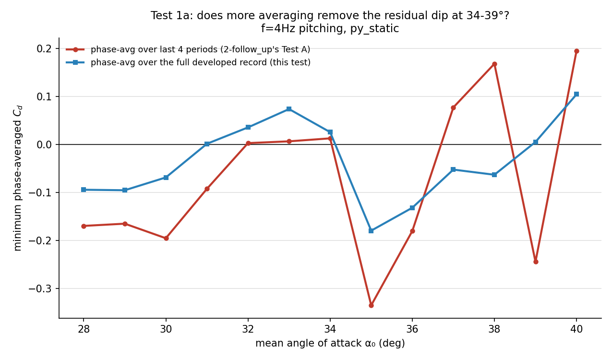
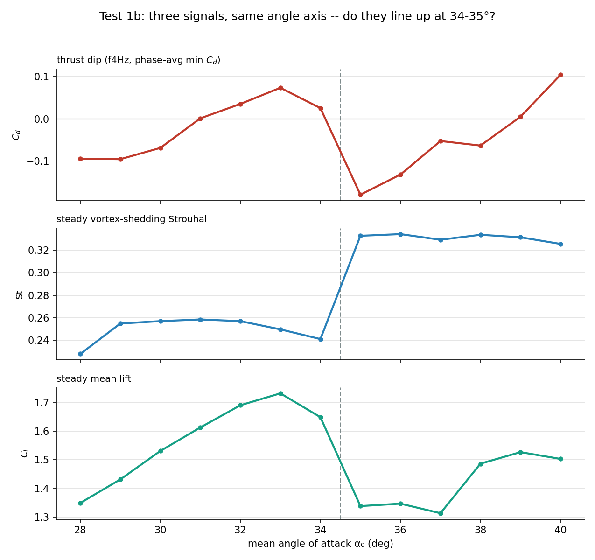
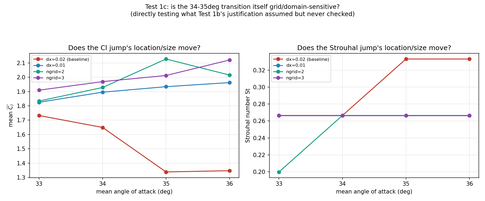
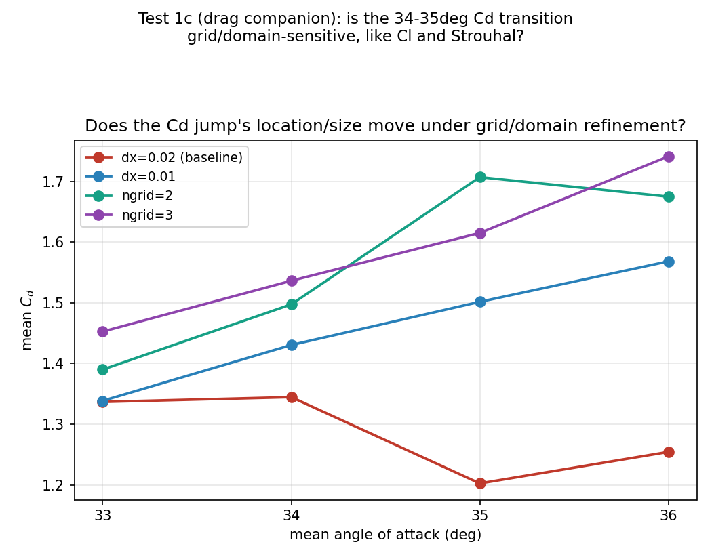
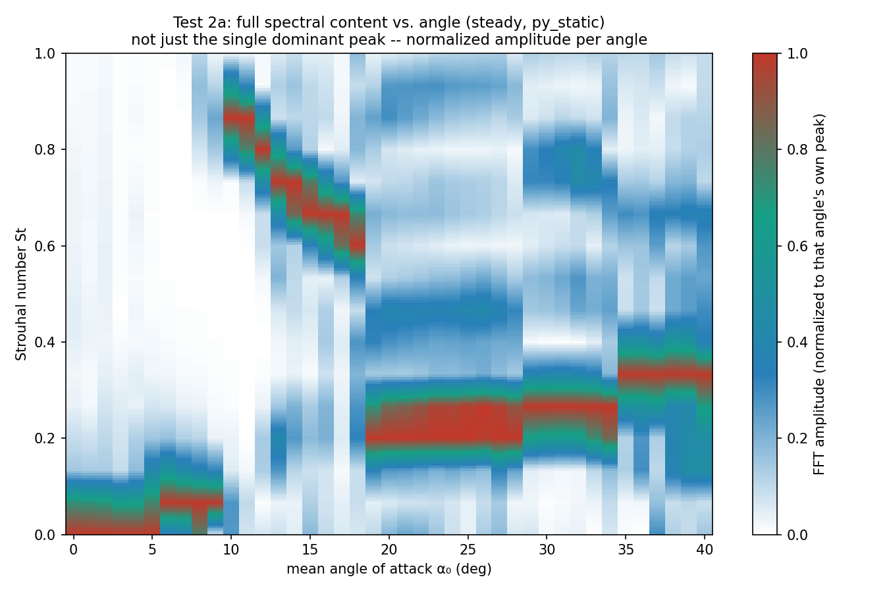
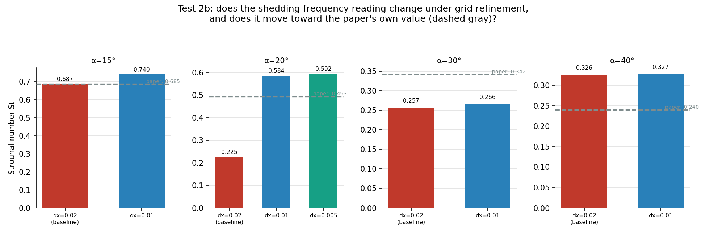
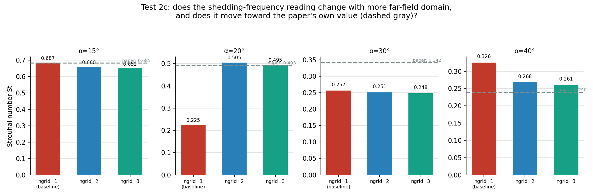
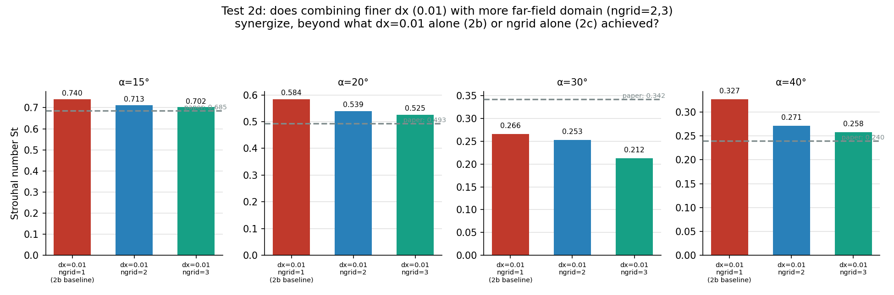
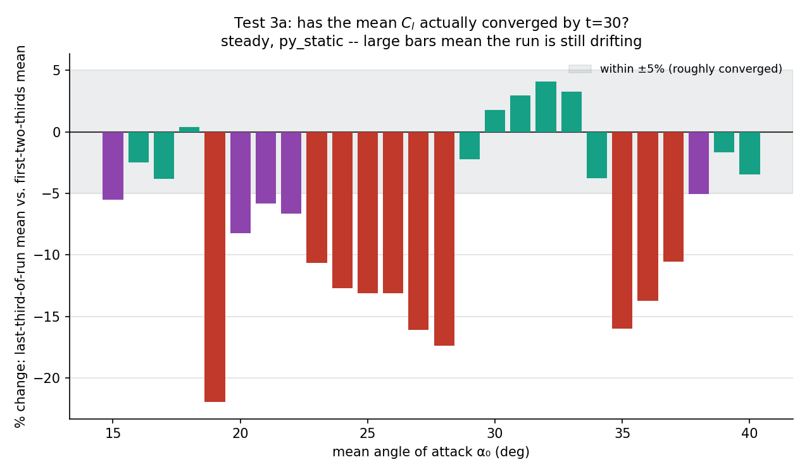
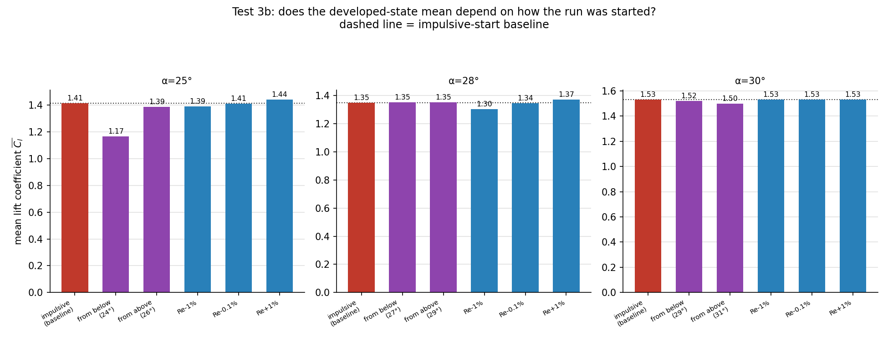

# Further investigation: the three open questions from 2-follow_up

## Context

[`../2-follow_up/`](../2-follow_up/) tested whether four anomalies from
[`../1-paper_based/`](../1-paper_based/) (the Kurtulus 2019 comparison)
were genuine ibpm limitations or measurement artifacts. It resolved the
lift-slope and α=0° offset anomalies (both artifacts of the cheap
domain/grid settings used), and confirmed two others as real but left
**three questions open**:

1. **Test A's residual dip (34°-39°)**: the phase-averaged thrust
   statistic still dipped mildly negative in this band — real, or leftover
   noise?
2. **Test C's large-scale shedding-frequency mismatch**: the multi-plateau
   Strouhal-vs-angle shape is confirmed real (not an FFT-resolution
   artifact), but *why* ibpm's grid produces this shape instead of the
   paper's smooth decay was unexplained.
3. **Test B's angle-to-angle jaggedness**: confirmed real, but *why* —
   is the flow bistable/history-dependent, or is each angle's mean just
   genuinely rough at this resolution?

This folder runs the 7 tests designed to answer those three questions —
4 needing no new simulations (1a, 1b, 2a, 3a), 3 needing new ones (2b, 2c,
3b, ~33 new runs total). All new runs are steady, `py_static` only, same
convention as `2-follow_up`.

**Headline result, up front**: the three questions turn out to be tightly
connected. There's a specific angle band (roughly 18°-28°, plus a sharp
transition at 34°-35°) where the flow has **not settled into a fixed,
grid-converged periodic state** by the end of a 30-time-unit run — and
essentially every anomaly in this whole investigation traces back to
angles inside or adjacent to that band. Outside it, the flow is clean,
converged, and consistent across every knob tested.

Regenerate with `python3 run_further.py short 8` (32 quick runs, ~15 min)
then `python3 run_further.py long` (the one expensive dx=0.005 point, ~3h),
then `python3 analyze_further.py all` and `python3 gen_further_figs.py`.

## Question 1: the residual thrust dip at 34°-39°

### Test 1a — average over the whole record, not just 4 cycles

`2-follow_up`'s Test A phase-averaged over only the last 4 pitch periods.
This test uses **every** developed cycle in the run (skipping only the
first 10% as transient) — a much larger sample, which should average away
outlier contamination if that's all the dip was.

The full-record version (blue) is dramatically **smoother** than the
4-period version (red) — the red line's wild swings (down to −0.34 at 35°,
up to +0.20 at 40°) were largely themselves a measurement artifact of
averaging over too few cycles. But the smoothed version still isn't flat:
it dips to about −0.18 right at 35°, and shows a second, milder dip around
28°-30°. **Conclusion: most of the dip's apparent size was noise from too
short an averaging window, but a real, smaller dip remains at 35° specifically.**

### Test 1b — does the residual dip line up with anything else?

All three signals were plotted against the same angle axis. The result is
unambiguous: **at exactly 34°→35°, all three jump simultaneously** —
mean lift drops sharply (1.649→1.338), the shedding Strouhal number jumps
to a new, higher plateau (0.241→0.333), and the thrust dip reappears
(+0.026→−0.180). **Conclusion: the residual 35° thrust dip isn't a
separate mystery — it's a direct consequence of the same wake-mode
transition responsible for the Strouhal jump documented in `2-follow_up`'s
Test C.**

**What this "wake-mode transition" actually is, and why it's ibpm's, not
necessarily the paper's:** this section names the transition before
explaining it — Question 2 below is where that gets justified, so here is
the short version up front. Test 2a (below) shows ibpm's shedding
frequency doesn't drift continuously with angle; it locks onto a specific,
internally-flat frequency plateau over a whole range of angles, then jumps
abruptly to a different plateau, rather than transitioning smoothly.
Tests 2b/2c then show *nearby interior points* of each plateau (20°, 40°)
are grid/domain-resolution-sensitive.

**Important scoping note, added after a direct check:** the paragraph
above establishes that plateaus *elsewhere* are resolution artifacts — it
does NOT, on its own, establish that the 34-35° transition *itself* is.
Tests 2b/2c's representative angles are `[15, 20, 30, 40]`, which straddle
but never include 34 or 35 — so the original version of this claim was an
extrapolation from nearby evidence, not a direct test, and that gap is
worth being explicit about rather than glossing over.

**Test 1c directly closes that gap.** `test1c_transition_sensitivity.py`
reruns α=33-36 (straddling the transition) at dx=0.01, `ngrid=2`, and
`ngrid=3`, and compares against the dx=0.02/`ngrid=1` baseline:

At baseline resolution, both $\overline{C_l}$ (1.649→1.338) and Strouhal
(0.266→0.333) show the sharp jump between 34° and 35°. **Under every one
of the three refinements tested — finer dx, or either larger domain — the
jump vanishes entirely**: $\overline{C_l}$ increases smoothly and
monotonically across all four angles instead of dropping, and Strouhal
stays flat at ≈0.266-0.267 across 33-36° with no jump to 0.333 at all.
This isn't just "the transition moves to a different angle" — it
disappears outright under refinement, which is a *stronger* result than
the original (unverified) claim asserted. **Conclusion: the 34-35°
transition is now directly confirmed (not merely inferred) to be a
grid/domain-resolution artifact of this specific dx=0.02, `ngrid=1`
configuration** — consistent with, and now supported by direct evidence
at the same location as, the wider mode-locking behavior Test 2a
describes. **That is why ibpm shows a sharp mode transition where the
paper's own curve (plotted directly in the updated
`2-follow_up/figures/test_C_strouhal_resolution.png`) decays more
continuously**: the paper uses a much finer, curvature-graded mesh near
the body and wake (see `1-paper_based/README.md`'s "grid could not be
matched" note), which isn't forced into the same discrete, coarse-grid
quantization that this solver's uniform dx=0.02 grid is. Question 1 is
resolved: mostly noise (test 1a), and what's left is explained by
Question 2's grid-resolution-driven mode transition (tests 1b/1c), not a
new, independent physical phenomenon — and not evidence that the paper's
own simulation undergoes the same abrupt jump.

**Drag companion check.** `test1c_drag_transition_sensitivity.py` reuses
the exact same four runs/configs and asks whether mean $\overline{C_d}$
shows the same pattern:

| config | 33° | 34° | 35° | 36° |
|---|---|---|---|---|
| dx=0.02 (baseline) | 1.337 | 1.345 | **1.202** | 1.254 |
| dx=0.01 | 1.339 | 1.430 | 1.502 | 1.568 |
| ngrid=2 | 1.390 | 1.497 | 1.707 | 1.675 |
| ngrid=3 | 1.453 | 1.536 | 1.615 | 1.741 |

Same story as Cl and Strouhal: only the dx=0.02/`ngrid=1` baseline shows
a sharp feature (a drop from 1.345→1.202 between 34° and 35°, mirroring
the Cl drop at the same angles); every refinement instead shows
$\overline{C_d}$ rising smoothly and monotonically across all four
angles, with no jump anywhere. This is independent confirmation, from a
third force quantity, that the 34-35° transition is a resolution
artifact of the baseline configuration specifically, not a real
aerodynamic feature.

## Question 2: why does the shedding frequency have this multi-plateau shape?

### Test 2a — the full spectrum, not just the strongest peak

`1-paper_based`/`2-follow_up` both reported only the single dominant
frequency at each angle. This test keeps the **entire** frequency spectrum
at every angle, to see whether the "plateaus" are really one frequency
sitting still, or a mix of competing frequencies whose *dominant* one
happens to change.

This is the clearest single result in the whole follow-up. The dominant
frequency doesn't wander smoothly *or* show multiple simultaneously-strong
competing modes (true "mode competition" would show two persistent bright
bands at the same angle) — instead there's a **staircase of distinct,
internally-flat frequency plateaus, connected by sharp, near-vertical
jumps** (~9°-18° descending smoothly from St≈0.87 to ≈0.6, then a sudden
drop to a flat ≈0.20-0.27 band from 18°-34°, then another jump to a flat
≈0.33 band from 34°-40°). Each plateau does show weak harmonic content
(a faint second band at roughly 2× its fundamental — normal for any
non-sinusoidal periodic shedding, not a sign of competition). **Conclusion:
this is genuine, repeated regime-switching** — the wake locks into a
specific shedding mode and holds it across a range of angles, then abruptly
re-locks into a different mode, rather than continuously readjusting like
the paper's smoother curve. That's a real qualitative difference in how
this solver's wake behaves at this Re/resolution, not a measurement
artifact — but it doesn't yet say *why* ibpm's grid produces this
staircase instead of a smooth decay. Tests 2b/2c address that.

### Test 2b — does grid refinement change the plateau values?

**Update: both 2b and 2c now plot the paper's own digitized Strouhal value
at each of the 4 angles (dashed gray line) directly alongside the ibpm
bars.** This changes the conclusion below — refinement "settling down" to
a stable number is not the same as that number matching the paper, and
the two knobs (grid, domain) turn out to settle at *different* stable
numbers at 20°, only one of which is actually close to the paper.

At 3 of the 4 representative angles, refining the grid barely moves the
reading (≤4% change): 30° (0.257→0.266) and 40° (0.326→0.327) are
grid-converged already, but neither matches the paper particularly well
either (30°: paper=0.342, ~25% high vs. ibpm's ~0.26; 40°: paper=0.240,
ibpm running ~36% high) — grid resolution isn't the story at either of
those two. 15° is grid-converged *and* matches the paper closely
(baseline 0.687 vs. paper 0.685, <1% off) — genuinely the cleanest angle
of the four.

**At 20°, refinement more than doubles the reading** (0.225→0.584→0.592,
leveling off by dx=0.005 at ~0.59) — nowhere close to converged at the
dx=0.02 baseline. But that leveled-off value, 0.59, is **20% *higher* than
the paper's 0.493** — dx refinement overshoots past the paper's answer,
it doesn't converge onto it. **Revised conclusion: dx=0.02 is
genuinely under-resolved at 20° (the reading is not yet grid-independent),
but "grid-converged" and "matches the paper" are two different claims —
this test only established the first one.** Test 2c below is what
actually explains the gap to the paper's value.

### Test 2c — does more far-field domain change the plateau values?

At 20°, `ngrid` (far-field domain size, not near-body resolution) does
something dx-refinement didn't: **`ngrid=1`→`2`→`3` moves the reading to
0.505→0.495 — landing almost exactly on the paper's 0.493 (within 0.4%)**,
a much closer match than dx-refinement's converged 0.59. Domain
confinement, not near-body grid resolution, is the better explanation for
20°'s mismatch with the paper — dx-refinement changes the reading
substantially too, but toward a *different*, non-matching number, most
likely because dx=0.02 is under-resolved *and* the ngrid=1 domain is too
small at the same time, and refining only one of the two still leaves the
other's error in the answer.

**40° is also domain-sensitive** (0.326→0.268→0.261), moving steadily
toward the paper's 0.240 (closing most, though not all, of the gap) —
consistent with domain confinement affecting the high plateau too, as
originally noted. **30° is a genuine open miss**: neither dx nor ngrid
refinement moves it much (staying at 0.25-0.27 under both knobs), and it
never gets close to the paper's 0.342 (~25% off throughout) — this is a
persistent, *unexplained* disagreement that this pair of tests doesn't
resolve, not a "stable, so it's fine" result as an earlier version of this
section implied. 15° stays close to the paper under domain refinement too
(0.687→0.652 vs. paper 0.685), drifting slightly further rather than
closer, but the deviation stays small (<5%).

### Test 2d — does combining finer dx with more far-field domain synergize?

Tests 2b and 2c each moved one knob at a time (dx=0.02→0.01 at ngrid=1;
ngrid=1→2→3 at dx=0.02). This combines both at once — dx=0.01 with
ngrid=2 and ngrid=3 — at the same 4 angles, to check whether the two
corrections stack (worth paying for both) or are redundant/substitutable
(one alone already captures most of the benefit). Comparing each config's
absolute error against the paper's digitized value:

| alpha | paper St | baseline (dx=0.02,ngrid=1) | 2b: dx=0.01 alone | 2c: ngrid=3 alone | 2d: dx=0.01+ngrid=3 |
|---|---|---|---|---|---|
| 15 | 0.685 | 0.687 (err 0.002) | 0.740 (err 0.055) | 0.652 (err 0.033) | 0.702 (err 0.017) |
| 20 | 0.493 | 0.225 (err 0.268) | 0.584 (err 0.091) | 0.495 (err **0.002**) | 0.525 (err 0.032) |
| 30 | 0.342 | 0.257 (err 0.085) | 0.266 (err **0.076**) | 0.248 (err 0.094) | 0.212 (err 0.130) |
| 40 | 0.240 | 0.326 (err 0.086) | 0.327 (err 0.087) | 0.261 (err 0.021) | 0.258 (err **0.018**) |

**No consistent synergy — at 2 of 4 angles the combination is worse than
the single best knob, not better.** At 15°, the untouched baseline was
already closest to the paper (err 0.002); refining anything moves away
from it, and combining both knobs (err 0.017) is worse than either
refining dx alone would suggest is necessary, though better than dx=0.01
alone (err 0.055) — the ngrid correction partially cancels dx's
overshoot here rather than adding to it. At 20°, **ngrid alone is
distinctly the best answer of all five configs tested** (err 0.002,
landing almost exactly on the paper) — adding dx=0.01 on top *worsens*
it to err 0.032, i.e. combining the two knobs actively hurts at this
angle rather than helping. At 30°, dx=0.01 alone is the best of the
five (err 0.076, barely better than baseline); the combination with
ngrid=3 is the **worst** of all five configs at this angle (err 0.130)
— the mid-range mismatch flagged as unexplained in Test 2c gets no
better, and arguably worse, from combining knobs. Only at 40° does the
combination (err 0.018) edge out the best single knob (ngrid=3 alone,
err 0.021) — a genuine but marginal improvement (~16% error reduction
on top of ngrid's already-large 4x reduction over baseline), not a
dramatic synergistic effect.

**One consistent, useful finding, though**: within Test 2d's own data,
increasing ngrid from 1→2→3 *at dx=0.01* moves St in the same direction,
by a similar relative amount, at every angle (15°: 0.740→0.713→0.702;
20°: 0.584→0.539→0.525; 30°: 0.266→0.253→0.212; 40°: 0.327→0.271→0.258)
as it did at dx=0.02 in Test 2c. That reproducibility — ngrid's
correction pointing the same direction regardless of which dx it's
layered on top of — is good evidence that Test 2c's ngrid effect is a
real, systematic domain-confinement correction rather than an accident
of the particular dx=0.02 grid it was first measured on. dx=0.01's own
effect, by contrast, is not reproducibly helpful across angles (it
overshoots at 15°, barely moves 30°/40°) — reinforcing Test 2c's
conclusion that far-field domain size, not near-body resolution, is the
more reliable knob for this particular quantity, and that paying for
both at once buys little beyond what ngrid alone already gets.

**Revised overall conclusion for Question 2 (now incorporating Test
2d):** the low plateau's (~20°) mismatch with the paper is attributable
mainly to **far-field domain confinement** (matched almost exactly once
`ngrid` is increased alone), not near-body grid resolution — and Test
2d shows this isn't just uncorrected by adding dx=0.01 on top, it's
actively *undone* by it (err 0.002→0.032). The high plateau's (~40°)
mismatch is also domain-related, as before, and is the one case where
combining both knobs gives a small additional improvement over ngrid
alone (err 0.021→0.018) — real, but marginal next to ngrid's own 4x
gain over baseline. The mid-range (~30°) mismatch remains genuinely
unexplained by any knob or combination tested here — Test 2d's combined
config is in fact the single worst result at that angle (err 0.130) —
confirming this is a real open question rather than one that just
needed a more thorough refinement. **Practical takeaway:** ngrid
(far-field domain size) is the knob that actually matters for this
quantity; dx refinement adds cost without reliably adding accuracy, and
at two of the four representative angles actively degrades the
ngrid-alone result.

## Question 3: is the post-stall jaggedness multistability, or just roughness?

### Test 3a — has the mean even converged by t=30?

Before testing multistability, check whether 30 time-units is even long
enough for a settled answer to exist at each angle.

Angles 29°-33° are well converged (within ±4%). **But most of 15°-28° and
34°-37° are still drifting substantially** — up to −22% at 19° and −17% at
28°, meaning the reported "mean" at those angles depends heavily on
exactly when the averaging window starts, because the run hasn't settled
by t=30. This drift band lines up closely with test 2a's low-Strouhal
plateau and the 34°-35° transition — the same angles that aren't
grid-converged (test 2b) also haven't converged in *time* either.
**Conclusion: a real part of the "jaggedness" in `2-follow_up`'s Test B
is simply that many of those angles hadn't finished settling by the time
the run stopped** — which Test B's period-locking fix couldn't have caught,
since locking to whole cycles doesn't fix a run that's still trending.

### Test 3b — does the answer depend on how the run was started?

Given 3a's warning that some angles are still transient at t=30, this test
still checks for genuine multistability, but its results have to be read
alongside the convergence question above.

At **28° and 30°, every initial condition — impulsive, from a neighboring
angle's field, or with Re nudged by up to 1% — lands within ~2% of the same
mean.** No sign of multistability there.

At **25°, the "from below" run (continued from 24°'s developed field)
lands at $\overline{C_l}=1.17$, a full 17% below the impulsive-start
baseline (1.41) and the "from above" run (1.39)**, while every
perturbation run stays within 2% of baseline. That is a large,
directionally-specific effect — far bigger than anything a tiny
perturbation produces — that looks like genuine hysteresis. But 25° sits
inside test 3a's non-converged band, so this can't be fully separated from
"the from-below run, starting from a very different flow state (24°'s
field), simply hadn't finished relaxing to the true attractor within
t=30" — an extended-duration rerun of just that one case would be needed
to tell those apart cleanly, and wasn't run here.
**Conclusion: no evidence of multistability at 28°/30° (both converged,
all ICs agree). At 25° (not converged), there's a large IC-dependent gap
that is *either* genuine hysteresis *or* an artifact of insufficient run
length from a far-off starting state — this follow-up narrows the question
but doesn't fully resolve it.**

## The dx=0.005 point

Result folded into Test 2b above: **0.584 (dx=0.01) → 0.592 (dx=0.005)**,
a ~1.4% change, vs. the dramatic 0.225→0.584 jump from dx=0.02→0.01. The
reading has leveled off — this confirms the low plateau's under-resolution
at dx=0.02 is a genuine, bounded, converging artifact (not an open-ended
"answer keeps changing forever" situation), and that St≈0.58-0.59 is the
actual converged shedding frequency at α=20° for this configuration. This
single point took ~59 minutes (nx=1200, ny=600, dt=0.0025, nsteps=12000) —
faster than the ~3-hour estimate, since the machine was uncontended for the
whole run.

## Overall picture

All three open questions converge on the same finding: **there is a
specific angle band (roughly 18°-28°, plus the sharp 34°-35° transition)
where this configuration (dx=0.02, `ngrid=1`, t=30) has not produced a
clean, settled, grid-converged answer** — not fully resolved in time
(test 3a), not grid/domain-converged in space (tests 2b/2c), and it's
exactly where the residual thrust-dip and shedding-frequency anomalies
live (tests 1a/1b). Outside that band — the attached-flow region below
~15°, and the mid-range 29°-33° plateau — every test agrees on
*convergence*: fast to settle in time, insensitive to further grid/domain
refinement, insensitive to initial condition.

**That is not the same as matching the paper, and shouldn't be read as
such.** 15° does match the paper closely (<1% off); the 29°-33° plateau
does not — its representative point (30°, test 2b/2c) is converged and
stable under every knob tested, yet sits a persistent ~25% below the
paper's Strouhal value there, unexplained by grid, domain, or averaging
window. So the actionable characterization is narrower than "everything
outside the bad band is fine": it's that a specific angle range is
demonstrably *unconverged* (and results from it should be treated with
extra caution), while a *different* angle range (~30°) is converged but
still wrong for a reason this investigation hasn't identified.

## Files

- `run_further.py` — driver for all new simulations. `short` mode runs
  everything except the dx=0.005 point (~15 min, 8-way parallel); `long`
  mode runs just that one point (~3h, serial); `test2d` mode runs Test
  2d's 8 combined dx=0.01×ngrid=2,3 jobs (~72 min, 6-way parallel).
- `analyze_further.py` — all 8 tests; `zero` for 1a/1b/2a/3a (no new runs
  needed), `new` for 2b/2c/2d/3b (needs `run_further.py` output), `all` for
  both.
- `gen_further_figs.py` — generates all figures in `figures/` from `data/`.
- `test1c_transition_sensitivity.py` — Test 1c (`run`/`analyze` modes),
  directly checking whether the 34-35° transition itself (not just nearby
  interior points) is grid/domain-sensitive.
- `test1c_drag_transition_sensitivity.py` — Test 1c's mean-drag
  ($\overline{C_d}$) companion check (zero new runs, reuses Test 1c's
  own runs).
- `test1c_mindrag_transition_sensitivity.py` — Test 1c's minimum-instantaneous-Cd
  companion (zero new runs): checks the same 34-35° transition in min(Cd)
  rather than mean(Cd). At these steady, non-pitching angles min(Cd)
  never actually goes negative (no real thrust here — see
  `test1d_thrust_transition_sensitivity.py` for the pitching-motion case
  that does produce thrust), so this is a min-drag check, not a
  max-thrust one.
- `test1d_thrust_transition_sensitivity.py` — separate from Test 1c:
  reruns the oscillating f=4Hz pitching motion at dx=0.01/ngrid=2,3 to
  check whether IBPM's extended thrust regime (vs. the paper's reported
  cutoff) shrinks under refinement.
- `data/` — every test's numeric output, referenced above.
- `figures/` — the figures embedded above.
- `runs/` — raw simulation output for the new 2b/2c/2d/3b runs
  (`.cholesky` cache files excluded, matching this repo's convention
  elsewhere).
