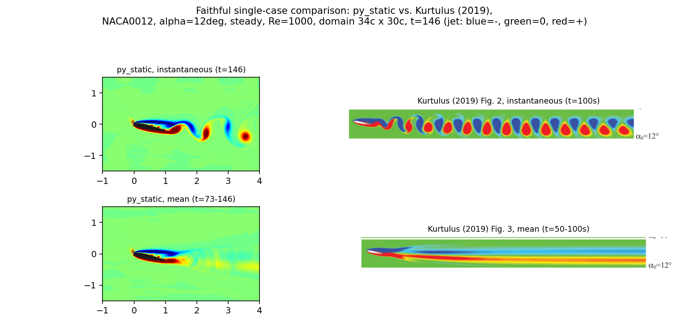
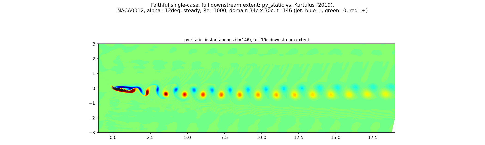

# One case, matched as faithfully as possible: NACA0012, α=12°, steady

Following the mentor's request: instead of a big sweep, one single case
(non-oscillating NACA0012, α=12°, Re=1000), matched to Kurtulus (2019)'s
actual numerical setup as closely as this solver's architecture allows, so
any remaining disagreement is easier to reason about.

## What was matched, and what couldn't be

Re-reading the paper's own methods section turned up two mismatches with
what `1-paper_based`'s main sweep used, one bigger than expected:

| | 1-paper_based (main sweep) | Paper's actual setup | This run |
|---|---|---|---|
| Domain | 6c (x∈[-2,4]) | **34c** (x∈[-15,19], "far field boundary...15c upstream and 19c downstream") | **34c×30c** (y-extent inferred — paper doesn't state it explicitly; assumed same 15c radius as upstream, standard for a C-type mesh) |
| Duration / averaging | t=30, last 50% | **t=146**, last 50% ("simulated until t=100s...averaging...50s≤t≤100s", converted via the same c/U∞ non-dimensionalization used for pitch frequency elsewhere in kurt_comp) | **t=146, averaged over t=73-146** |
| Grid | dx=0.02 uniform | Unstructured near-body (first wall cell **0.0015c**) grading into a C-type structured far-field — not a single dx | **dx=0.02 uniform** (unchanged) |

**The grid could not be matched**, and this is worth being explicit about
rather than glossing over: the paper's mesh is graded (very fine at the
wall, coarsening outward), ours is uniform everywhere. Matching 0.0015c
uniformly across a 34c domain would need on the order of 20,000+ cells per
direction — days of compute, not one. dx=0.02 (already this repo's
production resolution) is the stated, honest compromise.

## Run

`run_faithful.py`, both `py_static` and `cpp_static`, launched concurrently
(2 of 8 cores — true multi-threading of a *single* run isn't available in
this codebase; see the chat discussion for why that wasn't pursued).
1700×1500 grid, dt=0.01, nsteps=14600. **Both completed cleanly, no NaN, no
errors**: py_static in 4.58h, cpp_static in 4.70h — much faster than the
initial pilot-based estimate (a 20-step pilot overestimated per-step cost
by ~5x, dominated by one-time setup overhead that doesn't repeat).

## Results

### Mean force coefficients

| | $\overline{C_l}$ | $\overline{C_d}$ |
|---|---|---|
| **This run** (py_static = cpp_static, t=73-146) | **0.501 ± 0.061** | **0.215 ± 0.004** |
| Paper (Fig. 1, steady curve, digitized) | 0.62 | 0.24 |
| Old `1-paper_based` result (6c domain, t=15-30) | 0.550 | 0.230 |

**py_static and cpp_static are identical to 3 decimal places** — confirms
this isn't a Python-port issue, consistent with everything else found in
this repo.

**The bigger, more carefully-matched domain moved the answer *away* from
the paper, not toward it** — the opposite of what happened for the
lift-*slope* at low, attached angles in `2-follow_up`'s Tests D/E. This
isn't a convergence artifact: splitting the averaging window in half
(t=73-109.5 vs. t=109.5-146) gives Cl=0.5017 and 0.5010 — essentially
identical, so the flow has genuinely settled into a stationary statistical
state by t=73, and the mean is real, not still drifting. To isolate exactly
what moved it, the *same* run's own early window (t=15-30, holding
duration fixed at the old convention but now inside the big domain) gives
Cl=0.494 — closer to the full run's 0.501 than to the old small-domain
run's 0.550. **That isolates the effect: enlarging the domain, on its own,
shifted Cl by about −0.05 to −0.06 at this post-stall angle** — extending
the duration afterward barely moved it further. Domain size matters here,
just not in the helpful direction.

### Shedding Strouhal number

**St = 0.734** (this run, t=73-146) vs. **0.795** (paper's Fig. 19,
digitized) — 7.7% low. The closest of the three comparisons here.

### Vorticity field — this is where the real story is

**Plotting frame, resolved.** The figures below are now rotated into
Kurtulus's own plotting frame (free-stream horizontal, airfoil pitched to
alpha0), the same fix applied in `1-paper_based` (see that README's "Wake
vorticity fields" section for the full derivation). This solver imposes
alpha0 by rotating the free-stream relative to a body that is never itself
rotated, so the raw solver-frame plots showed the airfoil horizontal and
the wake bent upward — purely a plotting convention, not a solver
difference. `gen_faithful_figs.py` now applies `R(-alpha0)` to the grid
coordinates and airfoil outline before drawing (vorticity itself doesn't
transform), matching the rotation protocol from `1-paper_based`.

(`wake_faithful_cpp.png` is visually indistinguishable from the py version,
as expected.)

**Instantaneous** (top row): the paper's field (right) shows a dense train
of tightly-packed alternating vortices filling the whole visible width.
Ours (left, same x-range) shows only 2-3 vortices near the body before the
field goes quiet.

**This is *not* because our domain is too short to show more** — extending
the same snapshot out to the full simulated 19c downstream:

**Correcting the plotting frame changes this part of the story, and it's
worth flagging explicitly rather than quietly carrying the old
conclusion forward.** The previous (solver-frame) version of this figure
was read as: vortices "grow larger, drift upward away from the wake
centerline, and fully dissipate into a quiet, featureless field well
before the domain ends at x=19." In the corrected, paper-matched frame,
that's not what the field shows — the alternating vortices instead persist
as discrete structures sitting close to a roughly constant offset
(y≈-0.4) essentially all the way to x≈19, gradually fading in
saturation/intensity (redder/bluer near the body, more washed-out/yellow
far downstream) rather than visibly drifting away or vanishing into
noise. Some of what previously read as "drift upward, then dissipate" was
apparently an artifact of plotting the wake in a frame tilted relative to
its own direction of travel. **This doesn't necessarily overturn the
grid-resolution explanation below** — the far-downstream vortices are
still clearly weaker/more diffuse than the paper's crop suggests theirs
are — but the *specific* claim of upward drift and full dissipation by
x≈10 should be treated as unconfirmed pending a closer look (e.g.
quantitative peak-vorticity-vs-x decay) rather than taken as established.

**Mean field** (bottom row): the paper's mean (right) is a smooth,
symmetric, cleanly-diffusing sheet. Ours (left) is visibly noisier and
less smooth, consistent with the same less-organized shedding seen in the
instantaneous field feeding into a messier average. This observation is
unaffected by the frame correction (both versions showed the same
near-body noise pattern).

## What this one case actually answers

Matching domain and duration **ruled out** two candidate explanations for
the original sweep's disagreement at this angle (both are now shown to
not be the dominant issue, and the surviving discrepancy is not a
convergence or blockage artifact) — that's useful, even though neither fix
brought the numbers closer. What's left standing, and now demonstrated
directly in the vorticity field rather than only inferred from force
statistics, is **grid resolution**: the one thing that couldn't be matched
(dx=0.02 uniform vs. the paper's 0.0015c-at-the-wall graded mesh) is the
most likely remaining explanation, and the field comparison shows *where*
it bites — not at the leading edge this time, but in the wake, where our
vortices look weaker/more diffuse far downstream than the paper's crop
suggests theirs are. (The earlier, stronger claim that they visibly drift
upward and fully dissipate by x≈10 turned out to be partly a plotting-frame
artifact — see the corrected `wake_faithful_py_wide.png` discussion above —
so the "how far downstream" part of this story is softer than originally
written and would benefit from a quantitative decay check, not just visual
inspection.) This connects back to the mentor's original
leading-edge/trailing-edge question: same underlying theme (near-body/wake
resolution), different visible symptom.

## Files

- `run_faithful.py` — the driver (resumable; `python3 run_faithful.py
  [py|cpp|both]`).
- `gen_faithful_figs.py` — generates the field-comparison figures.
- `runs/{py,cpp}/` — raw output (`.cholesky` cache files excluded, matching
  this repo's convention elsewhere).
- `figures/` — the 3 figures referenced above.
