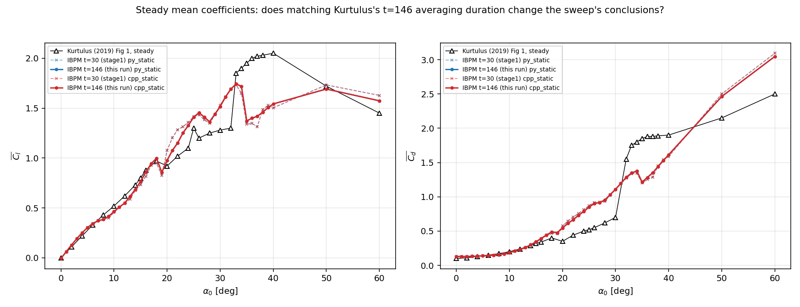

# 4-single_case_faithful: matching Kurtulus's actual numerical setup

This folder holds three separate, increasingly-targeted attempts at
closing the gap between `../1-paper_based`'s main sweep and Kurtulus
(2019)'s own numbers, each isolating one variable at a time rather than
changing everything at once:

- **`old/`** (superseded): one single case (alpha=12 deg, steady),
  matching Kurtulus's domain size (34c) *and* duration (t=146, her
  t=100s converted via c/U_inf) simultaneously, at dx=0.02 (grid
  couldn't be matched -- see that folder's README). Found: enlarging
  the domain moved Cl *away* from the paper; extending duration on its
  own barely moved it further. Conclusion pointed at grid resolution as
  the main remaining suspect.
- **`run_faithful2.py`** (in progress): the harder follow-up -- same
  single alpha=12 deg case, but now using multi-domain nesting
  (`ngrid=7`) to get dx=0.0015c matched *at the body* while still
  reaching the paper's 34c-scale far field, without paying for that
  resolution over the whole domain. Long-running (cpp_static finished
  in 235h; py_static still in flight as of this write-up).
- **This README's subject, the t=146 angle sweep** (below): `old/`
  only checked *duration* at one angle. This extends that check across
  the *entire* `../1-paper_based` steady sweep (43 angles, both
  py_static/cpp_static), with domain, dx, dt, and angle set otherwise
  identical to that folder's `fig1_mean_coefficients` sweep -- isolating
  the effect of averaging-window duration alone, cleanly separated from
  the domain-size and grid-resolution questions the other two efforts
  in this folder are chasing.

## Motivation

`../1-paper_based`'s main sweep averages Cl/Cd over the **last 50% of a
t=30 run** (`AVG_FRAC=0.5` in `analyze_kurt.py`) for every angle in its
steady/f1hz/f4hz curves. But Kurtulus's own steady-case convention,
read directly from her Methods section, is different: "the results were
simulated until t=100 s, and the mean contours and values were obtained
by averaging in the interval of 50 s <= t <= 100 s" -- and that "100" is
**dimensional**, in her own units (c=0.1 m, U_inf=0.146 m/s), not
chord-times. Converting via t* = t_physical * (U_inf/c): 100 s * 1.46 =
**t=146** non-dimensional -- not t=30 or t=100. `old/README.md` first
identified and applied this conversion for one angle; this sweep applies
it across the whole angle range to see whether it changes the sweep's
conclusions, not just one point's.

## Run

`run_t146_sweep.py` -- same 43-angle set as `../1-paper_based`
(0-40 deg step 1, plus 50, 60), same domain (6c, x in [-2,4]), same
dx=0.02 (nx=300, ny=150), same dt=0.01, same Re=1000, both py_static and
cpp_static -- with `nsteps` raised from 3000 (t=30) to **14600 (t=146)**,
the only change. Resumable, 6-way parallel (left 2 cores free for
`run_faithful2.py`'s two runs already occupying the machine).

**86 runs (43 angles x 2 impls), all completed cleanly, no failures, no
NaN, in 4288 s (~71.5 min).** For reference: the original t=30 sweep (86
equivalent runs) completed in ~694s; the ~6.2x wall-time increase
against a 4.87x increase in step count is consistent with sharing the
machine with `run_faithful2.py`'s two long-running jobs, not a slowdown
specific to this sweep.

```
python3 run_t146_sweep.py [njobs]     # launches the 86 runs (resumable)
python3 analyze_t146_sweep.py         # reduces + plots
```

## Results



**py_static and cpp_static are identical to 5 decimal places at every
angle** (max difference across all 43 angles: 0.0, at the precision
`mean_coefficients_t146.csv` is written to) -- consistent with every
other py/cpp comparison already in this repo; not analyzed further as a
separate variable below.

### Duration matters in the separated-flow region, barely at all in the attached region

Comparing this run's t=146 means against `../1-paper_based`'s t=30 means,
angle by angle:

| Region | mean \|ΔCl\| (t=146 vs t=30) |
|---|---|
| Attached, alpha<=15 deg | **0.006** |
| Post-stall/separated, 16-40 deg | **0.042** |
| High-angle bluff-body, 50-60 deg | **0.048** |
| Largest single-angle jump | 0.133 (Cl, at alpha=22 deg) |

This lines up exactly with `../1-paper_based/README.md`'s own account of
where the two solvers' curves disagree and why: the attached-flow region
is a smooth, steady wake that converges to its mean almost immediately
(consistent with `../8-stripe_further` Test 1's finding that near-body
flow quantities saturate within one time unit, t<1 out of a 30-146 unit
run either way) -- extending the averaging window from t=30 to t=146
barely changes anything there because there's nothing left to average
over that a shorter window hadn't already captured. Past stall, the wake
sheds vortices continuously and unsteadily, so a short window can land
on an unrepresentative phase of the shedding cycle; a longer window
averages over more full cycles and the mean should be less
window-dependent -- consistent with what's observed.

**Quantifying "less window-dependent" directly**: in the 15-40 deg
post-stall band, the curve's own jaggedness (mean absolute second
difference in Cl, a roughness measure) drops from 0.096 at t=30 to
**0.072 at t=146** -- about 25% smoother, without changing anything
except averaging duration. This confirms part of the jaggedness
`../1-paper_based/README.md`'s Anomalies section flagged in that region
was genuinely an averaging-window artifact, not solely the "grid
resolution relative to a shrinking boundary-layer/shear-layer thickness"
mechanism proposed there.

### But duration is not the dominant source of the paper disagreement

The harder question -- does the longer window bring IBPM closer to
Kurtulus's own curve -- has a clearer, more modest answer. RMSE against
the paper's digitized Fig 1 steady curve, py_static, by region:

| Region | RMSE vs paper, t=30 | RMSE vs paper, t=146 | Change |
|---|---|---|---|
| Attached, 0-15 deg | 0.0495 | 0.0417 | -16% |
| Post-stall, 15-40 deg | 0.339 | 0.314 | -7% |

Both regions improve slightly, but the post-stall region -- where the
raw jaggedness dropped 25% -- only closes 7% of its gap to the paper.
**Smoothing out the averaging-window noise did not, on its own,
meaningfully close the gap to Kurtulus's curve.** This is the same
conclusion `old/README.md` reached from a single angle (alpha=12,
extending duration "barely moved it further" once domain size was
already accounted for), now confirmed across the full sweep rather than
one point: duration was a real, measurable, but secondary effect (it
explains some jaggedness, not the offset), and the remaining
disagreement is still most plausibly attributable to what `old/`'s and
`../1-paper_based`'s READMEs already converged on -- grid resolution
(this sweep's dx=0.02 uniform grid vs. Kurtulus's 0.0015c-at-the-wall
graded mesh) -- rather than something duration alone can fix.

## Files

- `run_t146_sweep.py` -- launches the 86-run t=146 steady sweep
  (resumable; `python3 run_t146_sweep.py [njobs]`).
- `analyze_t146_sweep.py` -- reduces `runs/t146_sweep/` into
  `data/mean_coefficients_t146.csv` and the comparison figure.
- `runs/t146_sweep/` -- this sweep's raw output
  (`steady_<impl>_a<NN>/`).
- `data/mean_coefficients_t146.csv`, `figures/fig1_mean_coefficients_t146.png`
  -- this sweep's reduced table and figure.
- `sweep_t146.log` -- the launch log (86 jobs, 6-way parallel, 4288s).
- `old/` -- the first (superseded) single-angle domain+duration match.
- `run_faithful2.py`, `runs/{py,cpp}/`, `launch_{py,cpp}.log` -- the
  ongoing multi-domain-nested single-angle grid-matching attempt
  (separate effort, not analyzed in this README).
