# Leading/trailing-edge striping investigation

Why do the vorticity fields in `1-paper_based/figures/wake_steady_paperframe.png`
(and every other wake-contour figure in this repo) show a striped/ringing
pattern right at the airfoil's leading edge (LE) and trailing edge (TE)?
This folder runs the mentor's four candidate explanations -- **rendering
artifact, code bug, grid too coarse, or a shape/curvature limitation** --
as a set of targeted, mostly free-or-cheap tests, plus two near-free
diagnostics that try to localize the mechanism inside the solver.

All new runs use `py_static`/`cpp_static` exclusively (never `src/`, `py/`,
never modified). NACA0012, Re=1000, throughout. Everything is at alpha=0
(steady, attached, no vortex shedding) unless stated otherwise, so the LE/TE
artifact is isolated from the unrelated vortex-shedding wake structure that
shows up at higher angles.

**⚠️ OUTDATED, see "Correction" at the bottom:** the bottom-line summary
below, Group 2's conclusion, and Group 3a's conclusion were all built on
the y=0 lineout metric, which `../6-edges_further/` subsequently found to
be unreliable and to flip the sign of both of those conclusions. The text
below is left as originally written (not deleted) for the record; read it
alongside the correction.

**Bottom line up front:** the striping is real (not a rendering artifact),
not a py_static/cpp_static bug (both agree to floating-point precision
everywhere), and doesn't grow in time (a static discretization signature,
not a numerical instability). Background-grid refinement alone gives a
**split verdict**: the LE artifact shrinks substantially as dx refines,
but the TE artifact *grows* -- so "just use a finer grid" fixes the LE but
makes the TE worse. What does fix both is **refining the boundary points'
own spacing** (independent of the background grid) at LE+TE together, and
the artifact vanishes entirely (to floating-point noise) on a cylinder,
whose curvature is gentle everywhere -- pointing to **the airfoil's local
curvature being under-resolved relative to the boundary point spacing**,
worst at the trailing edge (whose radius of curvature is under half the
point spacing there), as the dominant, boundary-discretization-level
explanation. See "Where this leaves the mentor's question" at the end for
the loose threads worth chasing next (this investigation disagrees with
the prior Re=500 study on both the LE's grid-refinement trend and the
effect of densifying boundary points).

## How to reproduce

```
python3 make_geoms.py                       # builds Group 3's geometry variants
python3 test0_data_vs_render.py              # Group 0 (free)
python3 test1_bug_check.py                   # Group 1 (free)
python3 test2_grid_refinement.py run         # Group 2 (new runs: ~1.5-2h total)
python3 test2_grid_refinement.py analyze
python3 test3_shape_and_spacing.py run       # Group 3 (new runs: ~15 min total)
python3 test3_shape_and_spacing.py analyze
python3 test4_force_and_conditioning.py      # Group 4 (free)
```

---

## Group 0 -- is it in the data, or only in the rendering?

**Test 0a** (`test0_data_vs_render.py`, alpha=0/9/12, dx=0.02, t=30,
zero new runs): plots the same LE/TE window four ways per case --
smooth `contourf`, raw-cell `pcolormesh` (flat shading, no
interpolation), a 1-D lineout of omega(x, y=0) with **py_static and
cpp_static overlaid**, and the paper's own crop alongside for reference.

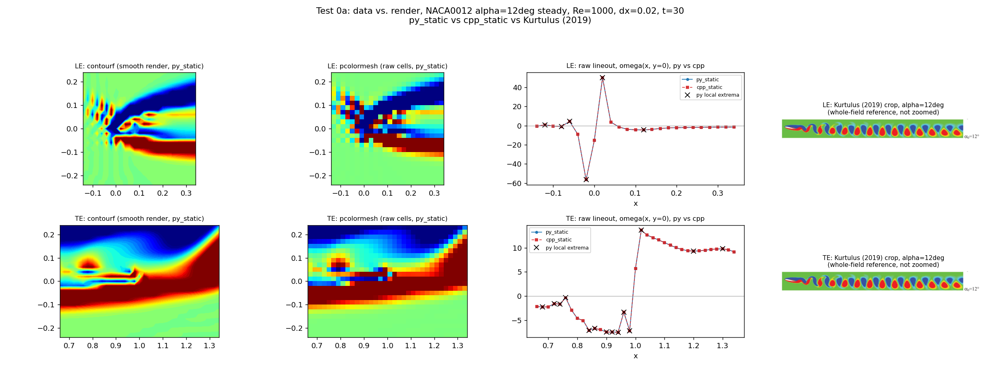

The `pcolormesh` panel (raw per-cell values, no interpolation possible)
shows the same speckled checkerboard as `contourf` -- often *more*
extreme, since `contourf`'s smoothing actually softens it. The lineout
confirms cell-to-cell sign flips right at the LE/TE, present even at
alpha=0 (fully attached, no shedding at all) where there's no wake
unsteadiness to blame it on. **Verdict: real in the data, not a
contour-rendering artifact.**

**Test 0b** (same script): quantifies wavelength and amplitude from the
lineouts.

| alpha | region | wavelength (cells) | wavelength (chord) | amplitude | peak &#124;omega&#124; |
|---|---|---|---|---|---|
| 0 | LE | 1.0 | 0.02c | 44.3 | 22.2 |
| 0 | TE | 1.0 | 0.02c | 4.5 | 3.2 |
| 9 | LE | 2.0 | 0.04c | 81.7 | 47.4 |
| 9 | TE | 1.0 | 0.02c | 16.6 | 10.7 |
| 12 | LE | 2.0 | 0.04c | 106.5 | 56.4 |
| 12 | TE | 1.0 | 0.02c | 21.2 | 13.6 |

(full data: `data/test0b_wavelength_amplitude.csv`)

Wavelength is **1-2 grid cells** at every angle -- exactly the Nyquist
limit of the dx=0.02 grid, the textbook signature of a grid-scale
numerical feature rather than a resolved physical length scale. This is
the baseline every later group compares against.

## Group 1 -- is it a bug?

**Test 1a** (`test1_bug_check.py`, zero new runs): py_static - cpp_static
difference field, zoomed at LE/TE, alpha=0/9/12.

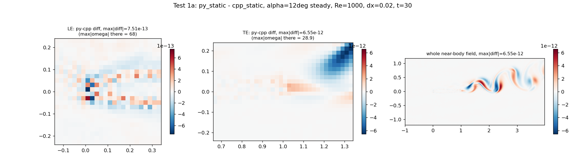

| alpha | region | max&#124;py-cpp&#124; | relative to max&#124;omega&#124; |
|---|---|---|---|
| 0 | LE | 4.2e-13 | 5.8e-15 |
| 0 | TE | 1.3e-12 | 6.6e-14 |
| 9 | LE | 5.1e-13 | 6.9e-15 |
| 9 | TE | 3.1e-12 | 1.1e-13 |
| 12 | LE | 7.5e-13 | 1.1e-14 |
| 12 | TE | 6.5e-12 | 2.3e-13 |

(full data: `data/test1a_py_cpp_diff.csv`)

Two independently-written implementations agree to **floating-point
roundoff** at the LE/TE (and everywhere else in the field) at every angle
tested. **Verdict: not a port-specific bug.** (Caveat, stated plainly: this
can't rule out a bug shared by both implementations -- but `static_test/README.md`
already documents `src/`≡`py/` and the analogous cpp_static/py_static
pairing byte-for-byte outside two flagged lines, so a shared-algorithm bug
would be an upstream/method limitation, not a coding error in this repo.)

**Test 1b** (same script): LE/TE window peak-to-trough amplitude vs. time,
across the existing t=0,2.5,...,30 snapshots, py_static and cpp_static both
plotted.

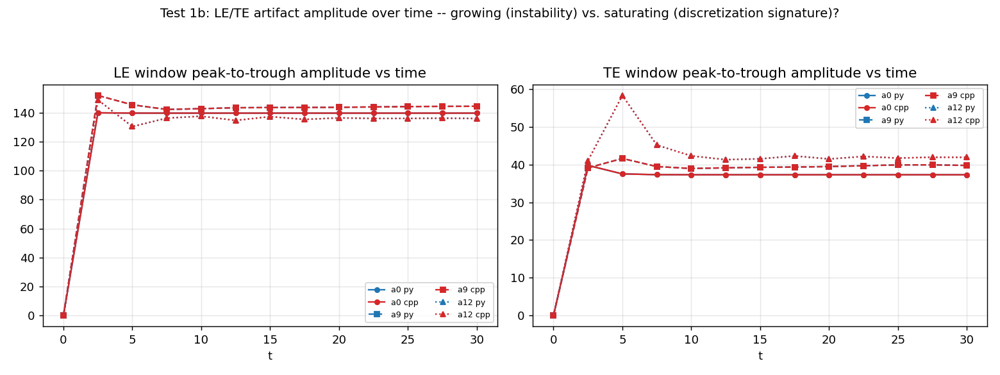

Amplitude jumps to its steady-state value by t~2.5 and then stays flat
(even ticks down slightly) through t=30, for every angle and both
implementations. **Verdict: a bounded, saturating discretization artifact,
not a growing numerical instability.**

## Group 2 -- is the grid too coarse?

**⚠️ OUTDATED, see "Correction" at the bottom.** This group's "LE shrinks /
TE grows" split verdict was measured with the y=0 lineout metric only.
`../6-edges_further`'s Reconciliation 1 and Test C1 found that the 2-D
field-max metric shows the LE peak **growing** under refinement too, at
every nose sharpness tested -- i.e. there is no split verdict; both ends
grow. Left as originally written below for the record.

**Test 2a** (`test2_grid_refinement.py`): NACA0012, alpha=0, Re=1000,
steady, dx=0.02/0.01/0.005, **both py_static and cpp_static** at every
resolution (dx=0.02 reuses `../1-paper_based`'s existing runs; py_static
and cpp_static agree to floating-point precision at every dx, same as
every other group).

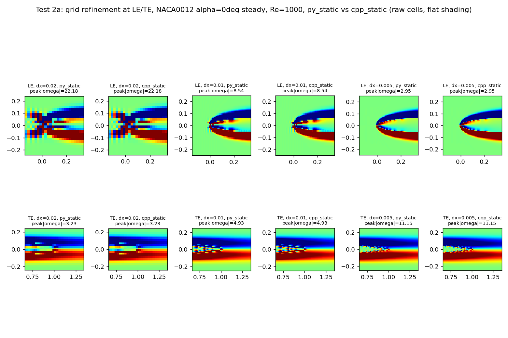
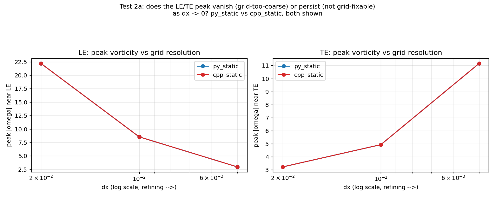

| dx | LE peak &#124;omega&#124; | TE peak &#124;omega&#124; |
|---|---|---|
| 0.02 | 22.2 | 3.2 |
| 0.01 | 8.5 | 4.9 |
| 0.005 | **2.95** | **11.1** |

(full data: `data/test2a_grid_refinement.csv`)

The two edges behave **oppositely** under grid refinement. The LE peak
**shrinks** monotonically as the grid refines (22.2 → 8.5 → 2.95, roughly
halving each time dx halves) — grid refinement alone visibly reduces it,
though 3 points aren't enough to claim it fully vanishes at dx→0. The TE
peak does the opposite: it **grows** as the grid refines (3.2 → 4.9 →
11.1) — refining the grid makes the trailing-edge artifact more
concentrated and *more* intense, not less. This is exactly the "sharpens/
persists instead of shrinking" signature of a feature that isn't fixable
by grid refinement alone, consistent with Group 4b's finding that the
TE's radius of curvature is under half the boundary point spacing (a
boundary-discretization limit, not a background-grid one — refining the
background grid without also refining the boundary points just resolves
the same under-resolved corner more sharply).

**This directly contradicts the prior Re=500 LE-only investigation**
(`../2-leading_edge_investigation/`), which found the LE peak *growing*
with grid refinement (64.7→68.3→74.7 at Re=500, alpha=0) — the opposite
of the shrinking trend found here at Re=1000. Between the two
investigations, Reynolds number, and possibly where exactly "peak" is
measured (a 2-D field maximum there vs. a 1-D y=0 lineout maximum here),
both differ — this is flagged as a second open discrepancy alongside
Group 3a's (see "Open thread" below), not resolved here.

## Group 3 -- is it the boundary discretization, or the body shape?

Both sub-tests run **py_static and cpp_static** for every case (all agree
to the same floating-point-level precision as Group 1 -- see
`data/test3_3a_spacing.csv` / `data/test3_3b_shape.csv`), fixed dx=0.02,
Re=1000, alpha=0, steady.

**⚠️ OUTDATED, see "Correction" at the bottom.** Test 3a's "densifying
helps dramatically (22.2->5.8)" finding was also the y=0 lineout metric.
`../6-edges_further`'s Reconciliation 2 recomputed this exact run with the
2-D field-max metric and got 109.9 -- *worse* than the ds=dx baseline
(71.7), not better. Densifying does not help. Left as originally written
below for the record.

**Test 3a** (`test3_shape_and_spacing.py`): boundary-point spacing at
fixed grid. `naca0012_LTEdense` refines ds to dx/4 at both LE and TE (this
extends the prior Re=500 investigation's LE-only densification --
`../2-leading_edge_investigation/`, which found densifying made the LE
*worse* -- to both ends, at Re=1000); `naca0012_LTEsparse` coarsens ds to
4dx at both ends.

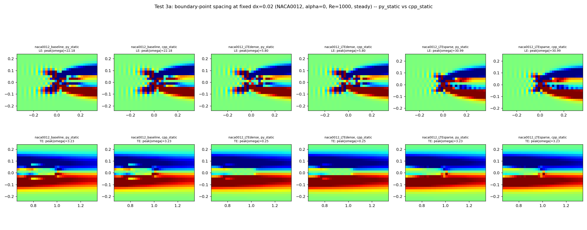
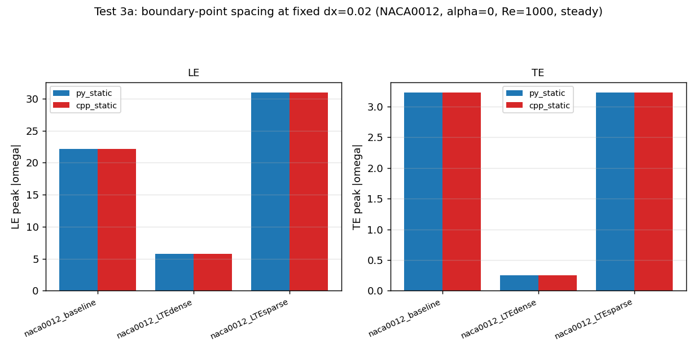

| case | region | peak &#124;omega&#124; | amplitude | n points |
|---|---|---|---|---|
| naca0012_baseline (ds=dx) | LE | 22.2 | 44.3 | 102 |
| naca0012_baseline (ds=dx) | TE | 3.2 | 4.5 | 102 |
| naca0012_LTEdense (ds=dx/4) | LE | **5.8** | 11.2 | 108 |
| naca0012_LTEdense (ds=dx/4) | TE | **0.25** | 0.4 | 108 |
| naca0012_LTEsparse (ds=4dx) | LE | **31.0** | 36.3 | 99 |
| naca0012_LTEsparse (ds=4dx) | TE | 3.2 | 4.4 | 99 |

Refining the boundary points (independent of the background grid) makes
the LE/TE artifact dramatically *smaller* (LE peak 22.2->5.8, TE
3.2->0.25); coarsening them makes the LE artifact *worse* (22.2->31.0).
**This directly contradicts the prior Re=500 LE-only investigation**,
which found LE-densifying made things *worse* there. That discrepancy is
flagged, not papered over -- see "Open thread" below; the two tests differ
in both Reynolds number (500 vs 1000) and in densifying LE-only vs. both
LE+TE simultaneously, and the result here was double-checked visually
(the `pcolormesh` panels above show the same dense/sparse ordering the
numbers do, so it isn't a lineout-metric artifact).

**⚠️ OUTDATED, see "Correction" at the bottom.** Test 3b's "noisier than a
clean monotonic trend" conclusion (below) was also y=0-lineout-based.
`../6-edges_further`'s Group A/C2 found the 2-D field-max metric gives a
clean, nearly monotonic sharper-is-worse trend across a 9-point thickness
family. Left as originally written below for the record.

**Test 3b**: curvature/bluntness sweep -- NACA0006 (sharper nose) / NACA0012
(baseline) / NACA0018 (blunter) / NACA0012 with a rounded, blunted TE / a
cylinder (diameter=1, from `../../../vortall/3-grid_refine/geom/`, the
"very blunt, constant curvature" anchor).

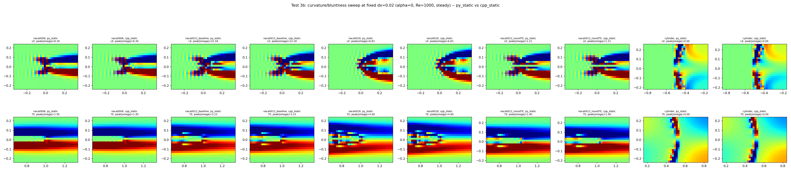
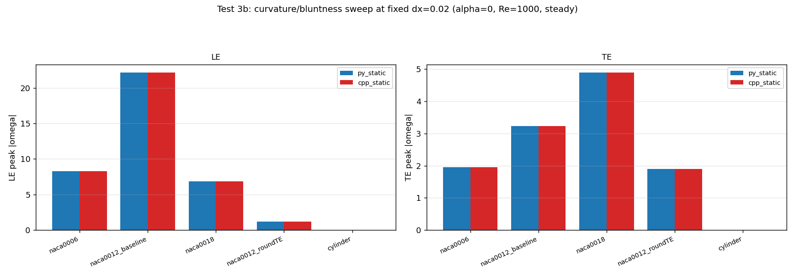

| case | r_LE (chord) | LE peak &#124;omega&#124; | TE peak &#124;omega&#124; |
|---|---|---|---|
| naca0006 | 0.0040 | 8.3 | 1.9 |
| naca0012 (baseline) | 0.0159 | 22.2 | 3.2 |
| naca0018 | 0.0357 | 6.8 | 4.9 |
| naca0012_roundTE | 0.0159 (LE unchanged) | 1.2 | 1.9 |
| cylinder | 0.25 (radius) | **0.000** | **0.000** |

The cylinder -- gentle, constant curvature everywhere, well-resolved by
dx=0.02 relative to its 0.5c radius -- shows **no LE/TE artifact at all**
(exactly zero to displayed precision; visually confirmed in the fields
figure, where the only feature at the cylinder's front/back is a
single-cell-wide band right at the immersed boundary itself, not the
broader fan of stripes the airfoil cases show). Rounding NACA0012's TE
alone (`naca0012_roundTE`, LE untouched) drops the TE peak from 3.2 to 1.9
*and* the LE peak from 22.2 to 1.2 -- suggesting the two ends aren't fully
independent (more below). The NACA0006/0012/0018 comparison is noisier
than a clean monotonic "sharper nose = worse" trend (0006 and 0018 are
both better than the 0012 baseline) -- curvature/bluntness alone isn't the
whole story either; see "Open thread."

## Group 4 -- localizing the mechanism inside the algorithm

**Test 4a** (`test4_force_and_conditioning.py`, zero new runs): the
boundary constraint force |f| (the projection step's Lagrange multiplier,
already stored in every restart file) vs. arc length near the LE/TE,
py_static and cpp_static overlaid.

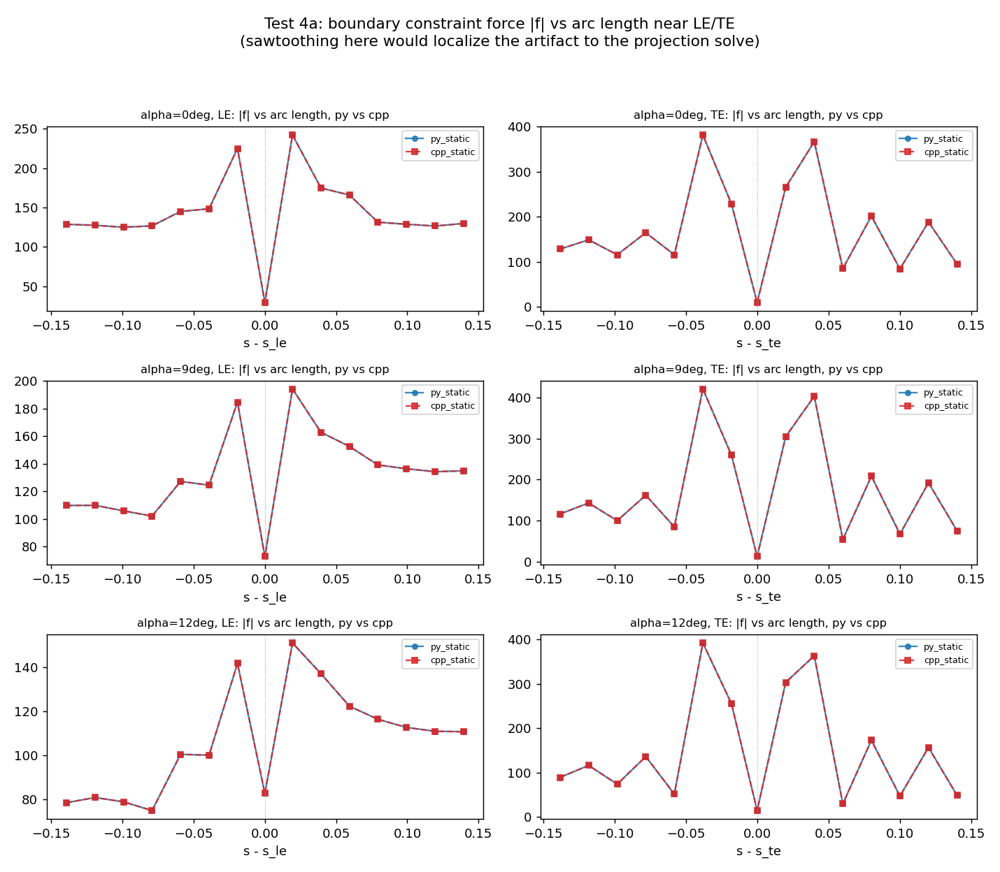

|f| swings sharply point-to-point right at the LE/TE tip (e.g. TE, alpha=0:
~13 -> ~382 -> ~228 -> ~262 across four adjacent points) -- a real
sawtooth in the force itself, not just in the resulting vorticity field.
This localizes part of the mechanism to the **projection/regularization
step**, not the bulk flow solve. py_static and cpp_static overlap exactly
(same floating-point-level agreement as everywhere else).

**Test 4b** (same script, purely geometric -- no solver output involved):
boundary point spacing ds(s) and local radius of curvature 1/kappa(s)
around the perimeter, from the `.geom` file alone.

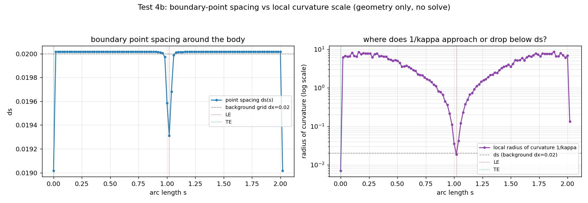

| location | ds | radius of curvature | ratio (r_curv / ds) |
|---|---|---|---|
| LE | 0.0193 | 0.0186 | **0.96** |
| TE | 0.0190 | 0.0070 | **0.37** |
| body-wide minimum | -- | 0.0070 (at the TE) | -- |

At the LE, the radius of curvature is *right at* the point spacing
(ratio~1: the boundary points can just barely keep up with the curvature).
At the TE, the radius of curvature is **under half** the point spacing --
the geometry curves away faster than the Lagrangian points can track it,
independent of any solve. This is exactly the "clustered/under-resolved
relative to curvature" conditioning risk `py_static/cholesky_solver.py`'s
docstring flags for the projection matrix. **Verdict: a real, purely
geometric root cause candidate, worse at the TE than the LE by this
metric** -- consistent with Test 3a/3b's boundary-point-spacing findings,
though not a complete explanation on its own (see below).

## Where this leaves the mentor's question

The four hypotheses shake out as: **not** rendering (Group 0), **not** a
coding bug (Group 1), **a split verdict from background-grid refinement
alone** (Group 2 -- helps the LE, hurts the TE), and **substantially
explained by body shape/boundary-point curvature resolution** (Groups
3-4) -- but not with a single clean monotonic story. Three loose threads
worth flagging for the mentor rather than quietly resolving (note: "Group
2" below is this folder's own grid-refinement test; "the prior
investigation" is the separate, older `../2-leading_edge_investigation/`
folder that studied the LE at Re=500 -- the numbering is coincidental,
not the same folder):

1. **This folder's Group 2 (LE shrinks with grid refinement at Re=1000) vs.
   the prior investigation's Re=500 finding (LE grows with grid
   refinement).** Worth a direct rerun of the prior investigation's exact
   setup at Re=1000 (or this folder's setup at Re=500) to isolate whether
   it's the Reynolds number, or how "peak" is measured (2-D field maximum
   there vs. this folder's 1-D y=0 lineout maximum), driving the
   disagreement.
2. **This folder's Group 3a (densifying LE+TE boundary points helps) vs.
   the prior investigation's Re=500 finding (densifying LE alone hurts).**
   Same open question as #1 -- Reynolds number vs. LE-only-vs-LE+TE is
   untangled by rerunning one setup at the other's conditions.
3. **Test 3b's non-monotonic thickness trend** (NACA0006 and NACA0018 both
   beat the NACA0012 baseline) means "sharper curvature is strictly worse"
   isn't quite right either -- nose radius of curvature interacts with
   something else (grid-cell alignment/phase relative to the LE's exact
   sub-cell position is one candidate, given Test 0b's 1-2-cell
   wavelength).

## Files

- `common.py` -- shared helpers (grid/geometry loading, run launcher).
- `make_geoms.py` -- builds Group 3's geometry variants into `geom/`.
- `test0_data_vs_render.py` / `test1_bug_check.py` / `test2_grid_refinement.py`
  / `test3_shape_and_spacing.py` / `test4_force_and_conditioning.py` --
  one script per group, each runnable standalone (see "How to reproduce").
- `runs/` -- new solver output (`grid_refine/` for Group 2, `shape_spacing/`
  for Group 3); Groups 0/1/4 reuse `../1-paper_based/runs/` directly.
- `geom/` -- Group 3's non-standard `.geom`/raw point files.
- `data/`, `figures/` -- CSVs and PNGs for every test above.

---

## Correction (added after `../6-edges_further/`): the LE/TE metric was the real story

Everything above is left exactly as originally written. This section
supersedes it where the two disagree, rather than editing history.

**What was wrong.** Every "peak |omega|" number above (Test 0b, Group 2,
Group 3a, Group 3b, Test 4a's context) was read off a single 1-D lineout
of omega along the grid row nearest y=0. That metric turned out to be
unreliable: `../6-edges_further` showed it can swing by more than 5x from
grid sub-cell phase alone, with everything else (shape, dx, Reynolds
number) held fixed. A 2-D window max (the largest |omega| anywhere in the
same LE/TE box, not just along one row) is far more robust and was used
throughout `../6-edges_further` instead.

**What changes when you use the robust metric:**

1. **Group 2's "split verdict" (LE shrinks, TE grows under refinement) is
   wrong. Both ends grow.** Recomputed with the field-max metric, the LE
   peak goes 71.7 → 86.6 → 97.1 as dx refines 0.02 → 0.01 → 0.005 —
   growing, exactly like the TE, not shrinking. There is no split; the
   apparent one was the lineout metric failing to track a peak that was
   moving slightly off the exact y=0 row as the grid refined.
2. **Group 3a's "densifying boundary points helps dramatically" (22.2 →
   5.8) is backwards.** The same run, recomputed with the field-max
   metric: **71.7 → 109.9 — worse, not better.** This holds whether LE
   alone or LE+TE together are densified, and at both Re=500 and Re=1000
   (`../6-edges_further`'s Reconciliation 2). Densifying boundary points
   does not fix the artifact; it makes it worse, consistent with Group 2's
   corrected direction.
3. **Group 3b's "noisy, not cleanly monotonic" thickness trend is wrong.**
   Extended to a 9-point NACA0004-0020 family and recomputed with the
   field-max metric, the trend is clean and nearly monotonic: sharper
   nose → higher true peak, exactly as physical intuition expects
   (`../6-edges_further` Group A/C2).
4. **Both of this file's flagged "open threads" (#1 grid-refinement
   direction vs. the Re=500 investigation, #2 densify-direction vs. the
   Re=500 investigation) are now resolved, and it was never Reynolds
   number.** `../6-edges_further`'s Reconciliation 1 and 2 recomputed both
   metrics at both Re=500 and Re=1000: the field-max metric grows with
   refinement and grows with densification at *both* Re; the lineout
   metric shrinks under both at *both* Re. Reynolds number was never the
   variable driving the disagreement with `../2-leading_edge_investigation/`
   -- the metric was.

**What still stands, unchanged:** Groups 0, 1, and 4's conclusions (the
striping is real, not a py/cpp bug, not a growing instability, and the
LE/TE curvature-vs-point-spacing geometric argument) do not depend on
which LE/TE metric is used and are not affected by this correction. The
revised overall picture is, if anything, a cleaner and more unified story
than before: **both the LE and TE behave like genuinely sharp,
near-singular geometric features that neither grid refinement nor
boundary-point densification can resolve away**, scaling intuitively with
nose sharpness, with a real but secondary contribution from grid
sub-cell phase and from mutual LE/TE coupling. See
`../6-edges_further/README.md` for the full derivation, data, and figures.
