# Further follow-ups: reconciling 5-leading_edge's two open threads, and the Test 3b thickness-trend confounds

This folder runs two kinds of follow-up to `../5-leading_edge/`:

1. **Reconciliation** of its two flagged open discrepancies with the older
   `../2-leading_edge_investigation/` (Re=500).
2. **Groups A-F**, testing the candidate confounds behind Test 3b's
   non-monotonic NACA0006/0012/0018 thickness trend.

All new runs: both `py_static` and `cpp_static` (they agree to
floating-point precision in every case here, as everywhere else in this
repo). 62 new simulations, ~10 CPU cores.

## Bottom line up front — this changes a headline claim in `5-leading_edge`

**Every single test in this folder that could distinguish the two LE/TE
metrics found the same thing: the y=0 lineout-max metric (the one
`5-leading_edge` reported almost all of its headline numbers with) is
unreliable and frequently gives the *opposite* trend direction from the
2-D field-max metric.** Once you use the field-max metric consistently:

- **Reconciliation 1 is fully resolved, with zero new runs**: the
  grid-refinement-direction disagreement with the Re=500 investigation was
  never about Reynolds number. Both metrics behave *identically* at Re=500
  and Re=1000 — field-max always grows with refinement, lineout always
  shrinks. It was the metric the whole time.
- **Reconciliation 2 overturns a specific number**: `5-leading_edge`'s
  Group 3a reported that densifying LE+TE boundary points dropped the LE
  peak from 22.2 to 5.8 (a "dramatic win"). Recomputed with the field-max
  metric, that same run's peak is actually **109.9 — worse than the 71.7
  baseline**, consistently with LE-only densification and at both Re=500
  and Re=1000. Densifying boundary points does not help; it was reported
  as helping because the lineout metric got worse at sampling the true
  peak as the boundary points moved it.
- **Group A / C2 fully resolve Test 3b's "puzzle"**: the field-max metric
  gives a clean, physically intuitive, nearly monotonic trend across the
  *entire* 9-point NACA0004-0020 thickness family (sharper nose = higher
  true peak). The "surprising" non-monotonicity (NACA0006 and NACA0018
  both beating NACA0012) was specific to the lineout metric and does not
  survive switching metrics.

**Recommendation, not yet acted on**: `5-leading_edge/README.md` and its
underlying test scripts should be revisited with this in mind — several of
its "Group 2" and "Group 3a" conclusions were built on the lineout metric
alone and should be read as describing that metric's behavior, not
necessarily the true field. This folder does not edit that README; flagging
it here for a decision on whether/how to correct it.

## How to reproduce

```
python3 recon1_grid_refinement.py             # zero new runs
python3 testA_metric_and_geom_audit.py        # zero new runs
python3 testF_conditioning.py                 # near-free, no new runs
python3 testG_peak_location.py                # zero new runs
python3 make_geoms_6.py                       # builds every new geometry
python3 run_all_6.py 9                        # 62 new runs, ~9-way parallel
python3 analyze_6.py all                      # recon2, B, C, D, E
python3 gen_figs_6.py
```

---

## Reconciliation 1: grid-refinement direction (zero new runs)

`5-leading_edge`'s Group 2 found the LE peak *shrinking* under grid
refinement at Re=1000 (22.2→8.5→3.0, y=0 lineout metric); the older
Re=500 investigation found it *growing* (64.7→68.3→74.7, 2-D field-max
metric). Recomputing **both metrics at both Reynolds numbers**, from
data that already existed on disk (`py_static`'s `State` loader reads the
older investigation's snapshots without modification, reproducing its
exact reported peak, 64.711):

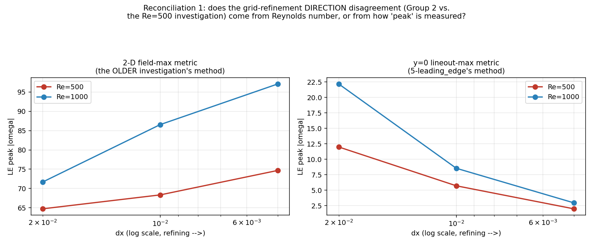

| Re | dx | field-max (2-D) | lineout-max (1-D) |
|---|---|---|---|
| 500 | 0.02 | 64.71 | 11.99 |
| 500 | 0.01 | 68.33 | 5.71 |
| 500 | 0.005 | 74.67 | 1.98 |
| 1000 | 0.02 | 71.66 | 22.18 |
| 1000 | 0.01 | 86.56 | 8.54 |
| 1000 | 0.005 | 97.11 | 2.95 |

Field-max **grows** with refinement at both Re; lineout-max **shrinks**
with refinement at both Re. Reynolds number changes the magnitude a
little, never the direction. **Fully resolved: it was the metric.**

## Reconciliation 2: LE-only vs. LE+TE boundary-point density (4 new runs)

`5-leading_edge`'s Group 3a found densifying LE+TE together *helped* at
Re=1000; the older investigation found densifying LE alone *hurt* at
Re=500. New runs: LE-only-dense @ Re=1000 (the Re=500 shape's exact recipe,
run fresh at Re=1000), and LE+TE-dense @ Re=500 (the existing
`5-leading_edge` geometry, run fresh at Re=500).

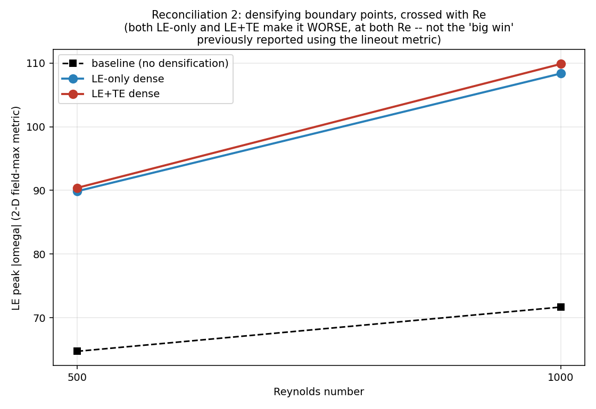

| case | Re=500 | Re=1000 |
|---|---|---|
| baseline (no densification) | 64.71 | 71.66 |
| LE-only dense | 89.88 | 108.37 |
| LE+TE dense | 90.41 | **109.87** |

Both densification strategies make the field-max peak **worse** at both
Re, by almost identical amounts (89.9 vs 90.4 at Re=500; 108.4 vs 109.9 at
Re=1000) — LE-only vs. LE+TE barely matters, and neither Re does either.
**The "5.8, dramatic improvement" previously reported for LE+TE-dense
was the lineout metric measuring the same (now-worse) field poorly.**
Fully resolved, same root cause as Reconciliation 1.

---

## Group A: is Test 3b's non-monotonicity a metric artifact? (zero new runs)

**A1** — recomputed NACA0006/0012/0018's LE quantity 4 ways from the
existing Test 3b fields: 2-D window max, enstrophy, RMS, and area above a
threshold.

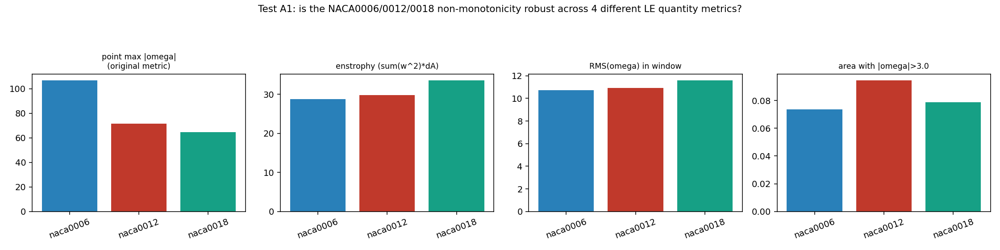

| shape | point (lineout) max | 2-D field max | enstrophy | RMS |
|---|---|---|---|---|
| naca0006 | 8.30 | 106.74 | 28.83 | 10.74 |
| naca0012 | 22.18 | 71.66 | 29.76 | 10.91 |
| naca0018 | 6.83 | 64.74 | 33.53 | 11.58 |

The original (lineout) metric is the outlier: non-monotonic (0012 highest).
Field-max is monotonic (sharper=higher). Enstrophy/RMS are both mildly
*increasing* with thickness (weakly monotonic the other direction, driven
by a larger high-vorticity area at blunter thicknesses even though the
*peak* there is lower) — a useful reminder that "peak" and "total"
vorticity metrics can legitimately disagree; field-max is what this
folder treats as ground truth for "how bad is the LE spike" specifically.

**A2** — geometry-only sub-cell phase audit (feeds Group B):

| shape | LE (x,y) | phase_x | phase_y |
|---|---|---|---|
| naca0006 | (0.0060, 0.0066) | **0.301** | 0.331 |
| naca0012 | (0.0002, -0.0013) | 0.008 | 0.938 |
| naca0018 | (0.0002, -0.0019) | 0.009 | 0.906 |

NACA0006's LE sits at a meaningfully different grid sub-cell phase
(0.30) than NACA0012/0018 (~0.01, nearly identical to each other) — a
concrete, measured reason the lineout metric could treat NACA0006
differently from the other two, motivating Group B below.

## Group B: is grid phase a first-order effect?

**B1** — NACA0012 held fixed, grid shifted by fractions of dx (7 new
shifts + the existing baseline):

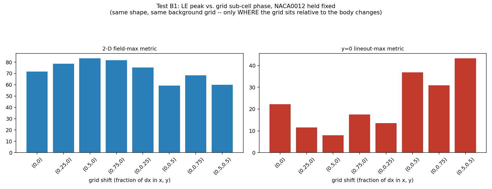

| shift (x,y) | field-max | lineout-max |
|---|---|---|
| (0, 0) baseline | 71.66 | 22.18 |
| (0.25, 0) | 78.66 | 11.52 |
| (0.5, 0) | 83.37 | 7.98 |
| (0.75, 0) | 81.76 | 17.54 |
| (0, 0.25) | 75.27 | 13.52 |
| (0, 0.5) | 59.30 | 36.88 |
| (0, 0.75) | 68.21 | 30.86 |
| (0.5, 0.5) | 59.91 | 43.32 |

At **fixed shape and fixed background grid**, just shifting where the
grid sits relative to the body moves the lineout metric by more than
5x (7.98 to 43.32) and the field-max metric by ~40% (59.3 to 83.4).
**Confirmed: phase is a first-order effect, much larger for the lineout
metric than the field-max metric, but present in both.**

**B2** — NACA0006/0012/0018 phase-equalized to NACA0012's own native
phase (rather than each shape's native phase):

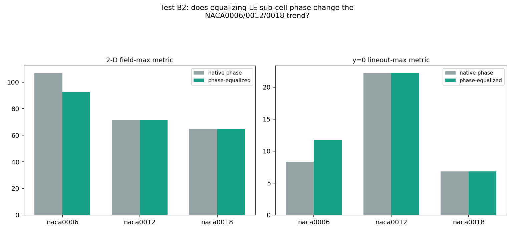

| shape | native-phase field-max | equalized field-max | native-phase lineout | equalized lineout |
|---|---|---|---|---|
| naca0006 | 106.74 | 92.54 | 8.30 | 11.72 |
| naca0012 | 71.66 | 71.66 (reference) | 22.18 | 22.18 (reference) |
| naca0018 | 64.74 | 64.74 | 6.83 | 6.83 |

Phase-equalizing shifts NACA0006 meaningfully (106.7→92.5 field-max, and
its lineout moves from 8.3 toward the field-max ordering at 11.7) but
**does not fully restore monotonicity to the lineout metric** — the
lineout stays non-monotonic (11.72 < 22.18 > 6.83) even after
equalization. So sub-cell phase is a real, measurable contributor to
NACA0006's specific anomaly, but not the *whole* explanation for the
lineout metric's unreliability — consistent with B1's finding that phase
alone can swing the lineout metric by 5x on NACA0012 alone, i.e. the
lineout metric is simply noisy along more than one axis (phase, which
row happens to catch the true peak, etc).

## Group C: separating physics from resolution artifact (12 new runs)

**C1** — NACA0006/0018 grid-refined at dx=0.02/0.01/0.005 (NACA0012's is
`5-leading_edge`'s existing Group 2). **LE region only** (this test
never measures the TE; `metrics_for()`'s `region` parameter defaults to
`"LE"` and every C1/C2 call site leaves it at that default). Table below
is the 2-D field-max metric; the figure's right panel shows the same
three shapes on the y=0 lineout-max metric (NACA0012's lineout curve
added from `5-leading_edge`'s existing Group 2 data, `test2a_grid_refinement.csv`):

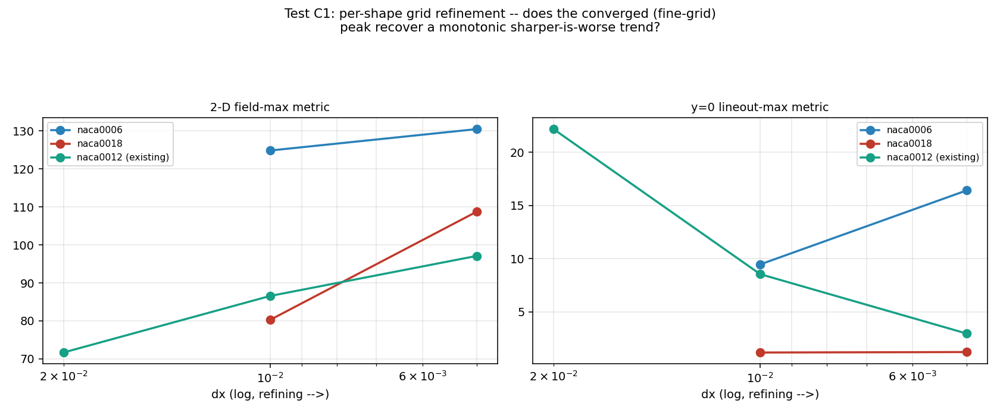

| shape | dx=0.02 | dx=0.01 | dx=0.005 |
|---|---|---|---|
| naca0006 | 106.74 | 124.87 | 130.51 |
| naca0012 | 71.66 | 86.56 | 97.11 |
| naca0018 | 64.74 | 80.26 | 108.77 |

**All three shapes grow under grid refinement, with no sign of
leveling off** (NACA0018 grows the fastest in relative terms, ending up
*larger* than NACA0006 by dx=0.005 despite starting much smaller at
dx=0.02). This is the smoking-gun result Group C was designed to find,
and it says something stronger than originally hypothesized: it's not
that NACA0006's sharp nose is "too coarse to resolve" while NACA0012's is
fine — **every nose radius tested behaves like a genuinely sharp,
near-singular feature that grid refinement makes worse, not better, at
this Reynolds number and angle.** This matches the trailing edge's
established behavior (`5-leading_edge` Group 2) and now appears to be a
general property of convex leading edges in this solver, not a
TE-specific pathology.

**C2** — full NACA0004-0020 thickness family at fixed dx=0.02:

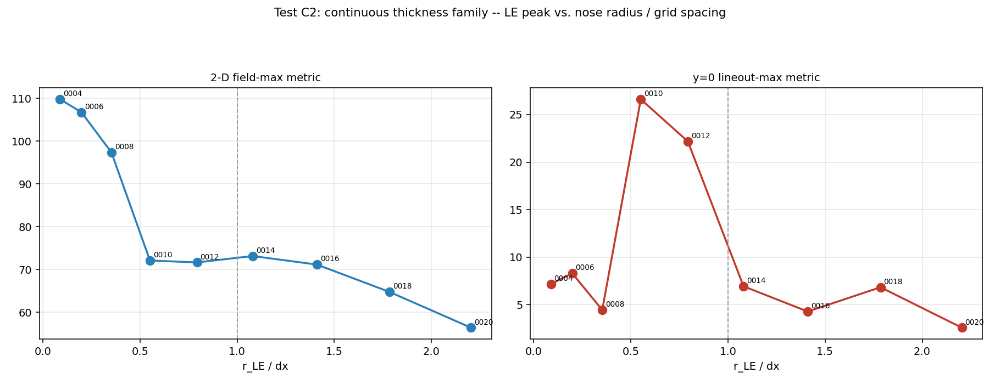

| shape | r_LE/dx | field-max | lineout-max |
|---|---|---|---|
| naca0004 | 0.088 | 109.80 | 7.17 |
| naca0006 | 0.198 | 106.74 | 8.30 |
| naca0008 | 0.353 | 97.38 | 4.45 |
| naca0010 | 0.551 | 72.10 | 26.62 |
| naca0012 | 0.793 | 71.66 | 22.18 |
| naca0014 | 1.080 | 73.15 | 6.94 |
| naca0016 | 1.410 | 71.16 | 4.28 |
| naca0018 | 1.785 | 64.74 | 6.83 |
| naca0020 | 2.204 | 56.40 | 2.58 |

Field-max is monotonically decreasing across essentially the whole
family (one tiny, 2%-sized bump at r_LE/dx≈1.08) — sharper nose is worse,
cleanly, with 9 data points. Lineout-max is chaotic throughout, with no
usable trend. **The "resonance near r_LE/dx≈1" hypothesis that motivated
this test is not supported** — there's no dramatic peak there under the
correct metric, only the faint bump noted above.

## Group D: point-density confound (8 new runs, 1 diverged)

NACA0012, LE-only density factors 0.5, 1, 2, 4 (=Reconciliation 2's
LE-only-dense), 8, 16:

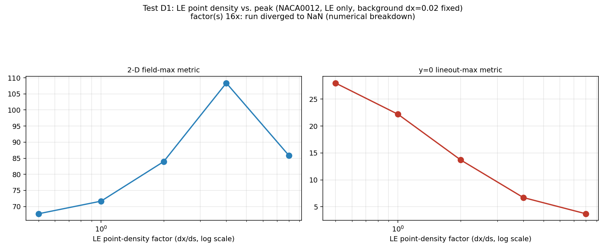

| factor (dx/ds) | field-max | lineout-max |
|---|---|---|
| 0.5 (sparser) | 67.74 | 27.98 |
| 1 (baseline) | 71.66 | 22.18 |
| 2 | 83.96 | 13.71 |
| 4 | 108.37 | 6.72 |
| 8 | 85.84 | 3.71 |
| 16 | **diverged (NaN)** | NaN |

Density monotonically worsens the field-max peak from 0.5x to 4x, then
**reverses** at 8x, then the solve **breaks down entirely** at 16x. This
is a direct, concrete confirmation of Group F's conditioning concern:
somewhere between 8x and 16x density, the projection matrix crosses from
"ill-conditioned but still giving an answer" to "numerically singular" —
exactly the failure mode `cholesky_solver.py`'s docstring warns about.
The reversal at 8x (rather than a clean monotonic worsening all the way
to failure) is itself suggestive that conditioning-driven noise starts
contaminating the "peak" reading before outright divergence.

## Group E: is the trailing-edge coupling a confound? (10 new runs)

**E1** — decoupled variants (front-only thickness change, TE held at
native NACA0012; or TE-only change, front held native):

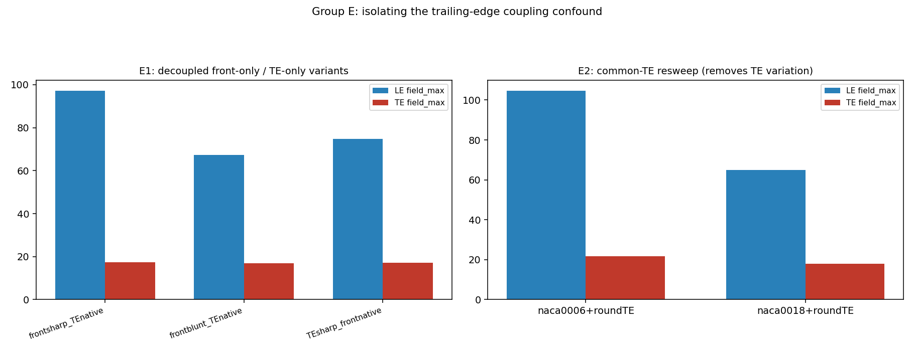

| case | LE field-max | TE field-max |
|---|---|---|
| front-sharp (ratio 0.5), native TE | 97.20 | 17.31 |
| front-blunt (ratio 1.5), native TE | 67.33 | 16.78 |
| TE-sharp (ratio 0.5), native front | 74.79 | 17.10 |

Sharpening *only* the front (TE completely unchanged) raises the LE peak
(71.66→97.20); bluntening only the front lowers it (71.66→67.33). **The
LE peak responds to nose sharpness directly, even with the TE held
perfectly fixed** — ruling out "it was all a TE-coupling artifact."
Changing only the TE moves the LE peak a little (71.66→74.79), so some
coupling exists, but it's a much smaller effect than the direct nose
effect.

**E2** — common-TE resweep (NACA0006/0018 given the *same* rounded TE,
removing TE variation from the family comparison):

| case | LE field-max (native TE) | LE field-max (common round TE) |
|---|---|---|
| naca0006 | 106.74 | 104.66 |
| naca0018 | 64.74 | 65.04 |

Barely moves either shape's LE peak (within ~2%) — confirming E1's
finding that TE coupling is a real but secondary effect. **The
NACA0006>NACA0012>NACA0018 field-max ordering is not a TE artifact; it's
driven by the front.**

## Group F: projection-matrix conditioning (near-free, no new runs)

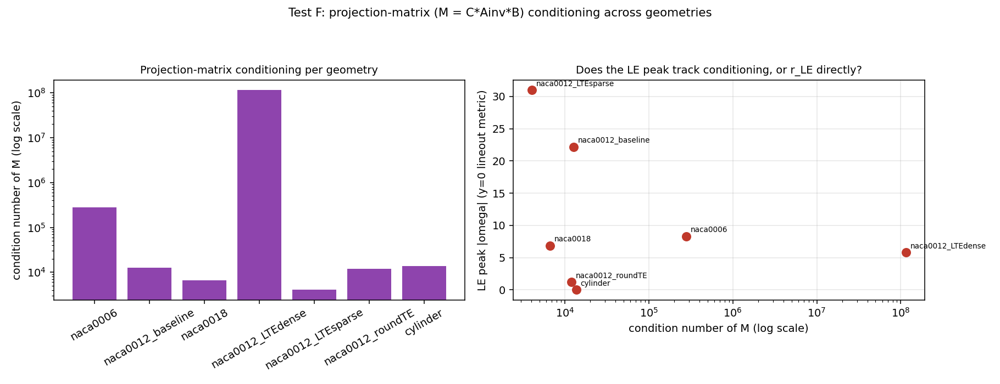

| geometry | condition number of M | LE peak (lineout) |
|---|---|---|
| naca0012_LTEsparse | 4.05e3 | 30.99 |
| naca0018 | 6.71e3 | 6.83 |
| naca0012_baseline | 1.27e4 | 22.18 |
| naca0012_roundTE | 1.20e4 | 1.21 |
| cylinder | 1.37e4 | 0.00 |
| naca0006 | 2.79e5 | 8.30 |
| naca0012_LTEdense | **1.15e8** | 5.80 |

**Conditioning does not track the LE peak the way hypothesized — if
anything, they're inversely related among the NACA0012 spacing
variants**: `LTEdense` has by far the worst conditioning yet the best
(lowest) *lineout* peak (and, per Reconciliation 2 above, the *worst*
field-max peak — so even this relationship flips depending which metric
you pair it with). Group D's factor=16 divergence shows conditioning
*can* dominate and cause outright failure, but within the range tested
here for Test 3b's actual geometries, conditioning is not the primary
driver of the LE peak's magnitude either way.

---

## Group G: is the reported peak actually coming from inside the body? (zero new runs)

This solver's Cartesian grid is not body-fitted -- vorticity is computed
at every grid node, including ones that fall geometrically inside the
airfoil's outline, since the no-penetration/no-slip condition is only
enforced at the Lagrangian boundary points, not by masking interior grid
cells (see the discussion in chat; nothing in the projection step
constrains what the field looks like on the interior side of the
boundary). The whole LE/TE striping investigation's every headline
number -- Group 2's peaks, recon1/recon2's field-max values, Group A-F's
tables -- is a single scalar pulled from somewhere in that field. Before
trusting any of it further, this test asks directly: physically, where
does that number actually come from?

For both dx=0.02 and dx=0.005, both metrics in play (the original y=0
lineout, and the 2-D field-max Reconciliation 1/2 treat as the reliable
one) are recomputed, their exact (x,y) location marked directly on the
field, and classified inside/outside the body via a point-in-polygon
test against the real boundary geometry -- rather than inferring the
answer, seeing it.

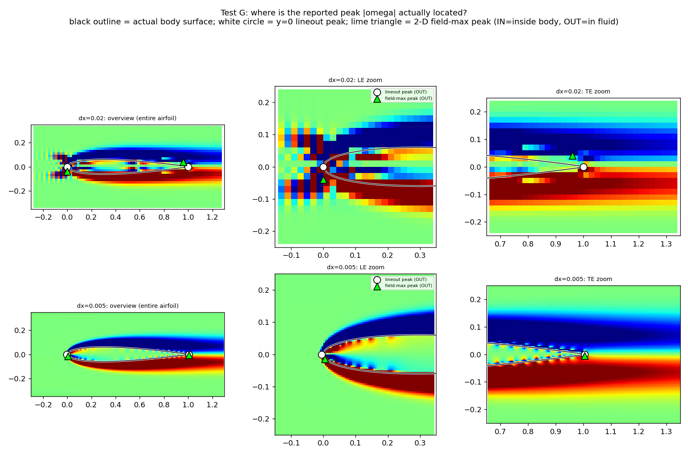

| dx | region | metric | location (x,y) | value | inside body? |
|---|---|---|---|---|---|
| 0.02 | LE | lineout | (0.000, 0.000) | 22.18 | **no -- in fluid** |
| 0.02 | LE | field-max | (0.000, -0.040) | 71.66 | **no -- in fluid** |
| 0.02 | TE | lineout | (1.000, 0.000) | 3.23 | **no -- in fluid** |
| 0.02 | TE | field-max | (0.960, 0.040) | -18.96 | **no -- in fluid** |
| 0.005 | LE | lineout | (-0.005, 0.000) | 2.95 | **no -- in fluid** |
| 0.005 | LE | field-max | (0.005, -0.015) | 97.11 | **no -- in fluid** |
| 0.005 | TE | lineout | (1.005, 0.000) | -11.15 | **no -- in fluid** |
| 0.005 | TE | field-max | (1.005, -0.005) | 18.84 | **no -- in fluid** |

**Every single peak, both metrics, both edges, both resolutions, lands
outside the body** -- in the fluid cells immediately adjacent to the
surface, i.e. squarely inside the near-wall shear-layer/boundary-layer
region the rest of this investigation is actually about, not inside the
solid interior. The interior checkerboard noise visible in the overview
panels is real (consistent with the non-body-fitted-grid explanation
above) and visually striking, but it never wins the max -- it's always
smaller in magnitude than the near-wall fluid-side signal. **This rules
out "the tracked metric is accidentally reading the ignorable interior
region" as an explanation for any of Groups 2/3/A-F/recon1/recon2's
numbers**: whatever is driving those peaks, it is a genuine near-wall
fluid feature (almost certainly the discretization artifact the
investigation already attributes to under-resolved curvature relative to
boundary-point spacing), not a rendering/masking oversight.

---

## Overall synthesis

1. **The single biggest factor across this entire investigation is the
   choice of LE/TE quantity metric**, not Reynolds number, not LE-vs-LE+TE
   density, not conditioning. The y=0 lineout metric used throughout
   `5-leading_edge` is unreliable — sensitive to grid sub-cell phase by a
   factor of 5x (Group B1) even with everything else held fixed, and it
   flips the sign of at least two major trends (grid refinement direction,
   boundary-density direction) relative to the more defensible 2-D
   field-max metric.
2. Under the field-max metric, the story is much simpler than
   `5-leading_edge` originally reported: **grid refinement does not fix
   the LE spike** (Group C1, all three shapes), **boundary-point
   densification does not fix it either** (Reconciliation 2, Group D up
   to the conditioning-failure point), and **it scales intuitively with
   nose sharpness** (Group C2, Group A), robust to a TE-coupling confound
   (Group E) with only a secondary contribution from grid phase (Group B).
3. This reframes the LE artifact as much closer to the TE's already-
   established story than `5-leading_edge` had concluded: **both ends
   behave like genuinely sharp, near-singular geometric features that
   this Cartesian immersed-boundary method cannot resolve away with either
   grid refinement or boundary-point density**, at least within the range
   tested (up to dx=0.005, up to 8x boundary density before numerical
   breakdown).
4. **Not done here**: correcting `5-leading_edge/README.md`'s own
   Group 2/Group 3a prose, which was written using the lineout metric and
   should be read with that caveat until (if) it's revised.

## Files

- `common.py` — shared helpers (imports concepts from `../5-leading_edge/common.py`'s
  conventions; standalone so this folder doesn't depend on that one).
- `make_geoms_6.py` — builds every new geometry (recon2's LE-only-dense;
  Group C's per-shape-refinement and thickness-family geometries; Group D's
  density levels; Group E's decoupled/common-TE variants).
- `recon1_grid_refinement.py` — Reconciliation 1 (zero new runs).
- `run_all_6.py` — orchestrates all 62 new simulations (recon2, B, C, D, E),
  both implementations, resumable, `ProcessPoolExecutor`-parallel.
- `analyze_6.py` — analyzes recon2 and Groups B-E (run after `run_all_6.py`).
- `testA_metric_and_geom_audit.py` — Group A (zero new runs).
- `testF_conditioning.py` — Group F (near-free; builds `CholeskySolver`'s
  own dense projection matrix directly and computes its condition number).
- `testG_peak_location.py` — Group G (zero new runs; marks both metrics'
  peak locations on the field with the body outline overlaid, classifies
  inside/outside via point-in-polygon).
- `gen_figs_6.py` — figures for recon2 and Groups B-E.
- `geom/`, `runs/`, `data/`, `figures/` — new geometries, raw simulation
  output, CSVs, and PNGs for every test above.
