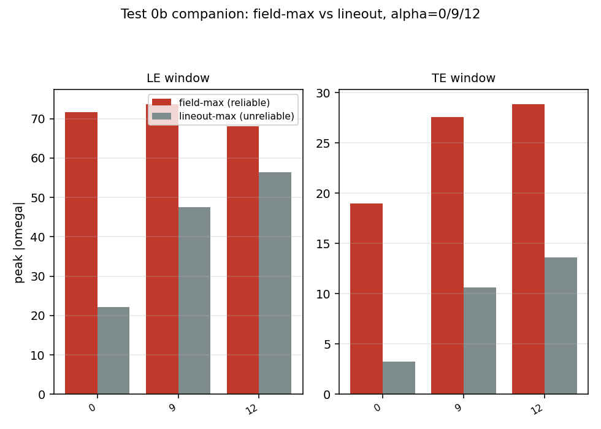
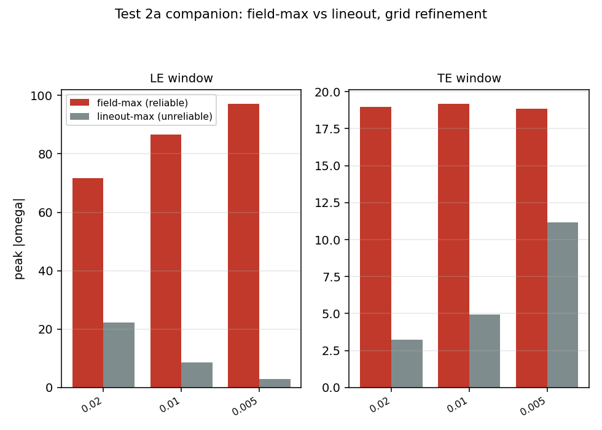
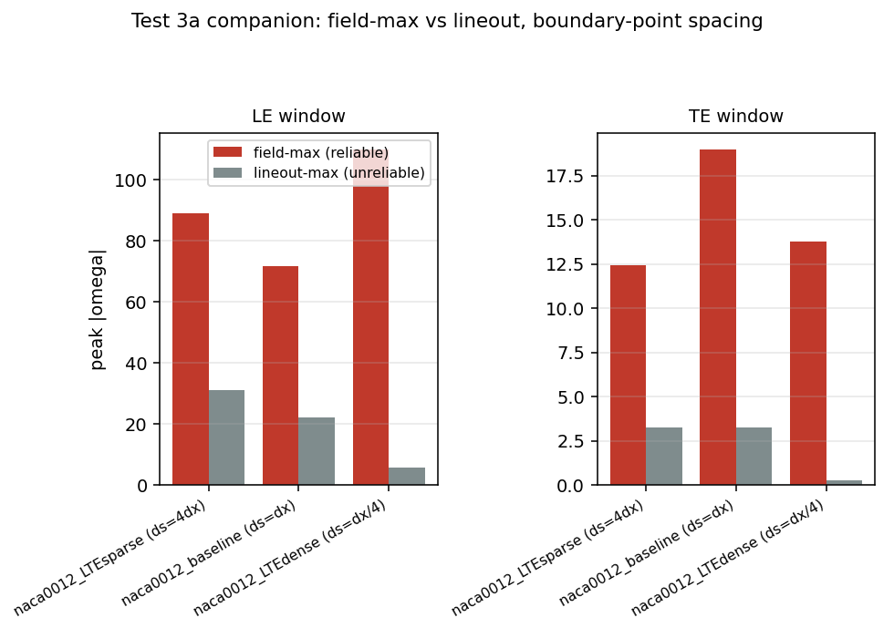
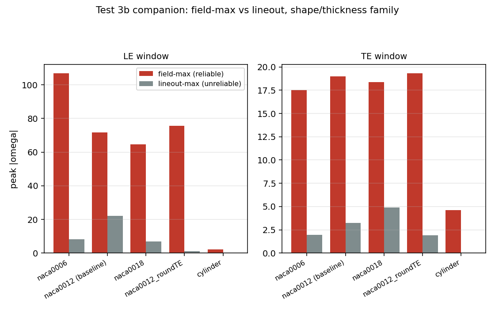
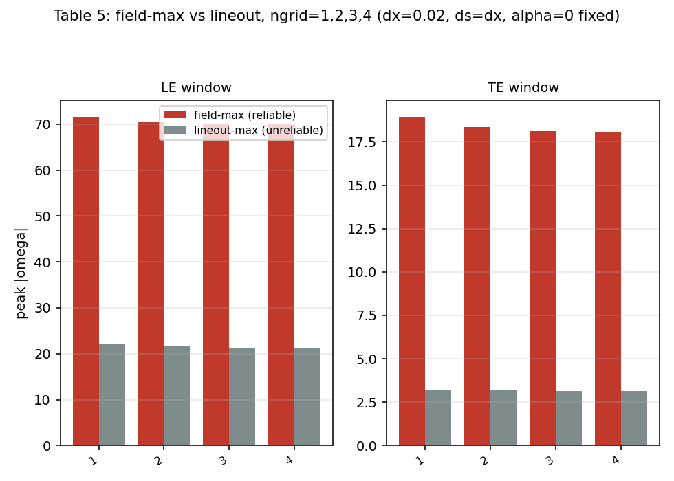

# field_updated: every `5-leading_edge` lineout number, redone with the 2-D field-max metric

`../README.md` established that `5-leading_edge`'s "peak |omega|" numbers
(Test 0b, Group 2/2a, Group 3a, Group 3b) were all read off an unreliable
1-D y=0 lineout, and recomputed most of them with the reliable 2-D
field-max metric across its own Reconciliation 1/2 and Groups A/C1/C2.
But that coverage was partial: several specific cases `5-leading_edge`
originally reported were never actually recomputed with field-max
anywhere in `../`. This folder closes that gap completely — one table
per original `5-leading_edge` group, LE and TE both, **zero new runs**
(every case reuses a flow snapshot already on disk in `../../1-paper_based/`,
`../../5-leading_edge/`, or `../../2-leading_edge_investigation/`).

**What's genuinely new here** (never computed with field-max before):
- **Test 0b's alpha=9° and alpha=12° cases** — `../` only ever worked at
  alpha=0.
- **Test 3a's `naca0012_LTEsparse`** (ds=4dx at LE+TE together) — `../`
  Reconciliation 2 covered baseline/LE-only-dense/LE+TE-dense, never
  this case.
- **Test 3b's `naca0012_roundTE` and `cylinder`** — `../` Group A only
  covered the naca0006/0012/0018 trio.

Everything else (Test 2a's dx sweep; Test 3a's baseline/LTEdense; Test
3b's naca0006/0012/0018) is recomputed here too, not just cited, so this
folder is a single complete, self-contained mirror of `5-leading_edge`'s
original 4 tables — every number consistently field-max, side by side
with the original lineout value for direct comparison.

**Update: every table below now also loads cpp_static for the same
case and confirms py/cpp agreement directly** (not assumed) — see each
table's "py/cpp agreement" line. **Update: added Table 5, a new ngrid=1-4
sweep** at this folder's default settings (dx=0.02, ds=dx, alpha=0,
Re=1000) — the one variable nothing in `5-leading_edge` or `../` tested
against the LE/TE field-max peak specifically (8 new runs; every other
table above remains zero-new-runs).

## Definition: what "2-D field-max" actually means

**Not** "every y value to the left of the LE and to the right of the
TE" — that unbounded-strip definition is a different quantity used
elsewhere in this repo (`../../7-stripe_investigation`'s "upstream
region," x < x_LE with no x-lower-bound). The 2-D field-max metric here
is the largest `|omega|` inside a small, fixed, **bounded** box around
each edge — bounded in x on both sides, not just one — exactly as
defined in `compute_fieldmax.py`:

```python
LE_XLIM, LE_YLIM = (-0.15, 0.35), (-0.25, 0.25)   # a 0.5c x 0.5c box straddling the LE (x=0)
TE_XLIM, TE_YLIM = (0.65, 1.35), (-0.25, 0.25)    # a 0.7c x 0.5c box straddling the TE (x=1)
```

So "LE field-max" = `max(|omega|)` over every grid cell with
`-0.15 <= x <= 0.35` and `-0.25 <= y <= 0.25` (a small window
*straddling* the leading edge on both the upstream and downstream
side of it, not extending indefinitely upstream) — and "TE field-max"
is the same idea, a window straddling the trailing edge at x=1. Both
windows are the same fixed size and position for every case in every
table here (same shape/dx/ngrid/angle), so the only thing that changes
between rows of a table is what's actually inside that fixed box. This
is also why it's called "field-max" rather than "upstream" or
"lineout": it's a genuine 2-D maximum over an area (both x and y vary),
as opposed to the old metric (a 1-D max along the single grid row
nearest y=0 only) or `7-stripe_investigation`'s separate "upstream"
quantity (unbounded in the −x direction, deliberately excluding the LE
region itself to isolate pure numerical artifact from real near-body
physics — a different question than "how bad is the peak near the
edge" this folder asks).

## How to reproduce

```
python3 compute_fieldmax.py       # Tables 1-4 (zero new runs) + Table 5 if its runs exist
python3 run_ngrid_sweep.py [njobs]  # Table 5's 8 new runs (~10 min, 6-way parallel)
python3 plot_field_only.py        # field-max-only versions of all 5 figures, no new computation
```

**`figures/field_only/`**: every figure below normally shows field-max
side by side with the lineout-max for direct comparison (the point of
this whole folder). `figures/field_only/` holds a field-max-only
version of each of the 5 figures — same data, same windows, just the
lineout bars removed — for whenever the lineout comparison isn't the
point and only the field-max numbers themselves need presenting.

---

## Table 1 (Test 0b companion): alpha=0°, 9°, 12°



| alpha | region | field-max | lineout-max (original) |
|---|---|---|---|
| 0 | LE | 71.66 | 22.18 |
| 0 | TE | 18.96 | 3.23 |
| 9 | LE | 73.71 | 47.44 |
| 9 | TE | 27.58 | 10.65 |
| 12 | LE | 68.00 | 56.43 |
| 12 | TE | 28.88 | 13.64 |

**This overturns the angle-dependence story, not just the magnitudes.**
The original lineout numbers made it look like the LE peak roughly
*doubles* from alpha=0 to alpha=12 (22.2→56.4) — a strong,
angle-driven trend. Under field-max, the LE peak is **essentially flat
across all three angles** (71.7, 73.7, 68.0 — a ~8% spread, no
monotonic direction). The TE peak *does* grow with angle under both
metrics, though less dramatically under field-max in relative terms
(19.0→27.6→28.9, ~52% total vs. lineout's ~320% total). So the original
"LE peak clearly worsens with angle of attack" reading was itself
substantially a lineout artifact — the real near-field LE severity is
close to angle-independent at these attached, pre-stall angles, and it's
specifically the TE that responds to angle.

**py/cpp agreement**: max relative difference on field-max across all 6
angle/region combinations = **6.1e-14** — floating-point precision, same
as everywhere else in this repo.

## Table 2 (Test 2a companion): grid refinement



| dx | region | field-max | lineout-max (original) |
|---|---|---|---|
| 0.02 | LE | 71.66 | 22.18 |
| 0.02 | TE | 18.96 | 3.23 |
| 0.01 | LE | 86.56 | 8.54 |
| 0.01 | TE | 19.17 | 4.93 |
| 0.005 | LE | 97.11 | 2.95 |
| 0.005 | TE | 18.84 | 11.15 |

Matches `../README.md`'s Reconciliation 1/recon1_le_te_field_max
numbers exactly (recomputed independently here from the same snapshots
as a completeness check, not just copied). **LE grows steadily under
refinement (71.7→86.6→97.1); TE stays essentially flat** (19.0→19.2→18.8)
— confirming there is no "split verdict" once field-max is used
consistently; refinement does not fix either edge, and if anything makes
the LE worse while leaving the TE unchanged (not "worse" as originally
read from the lineout's 3.2→4.9→11.1 climb).

**py/cpp agreement**: max relative difference on field-max = **1.6e-13**
(6 combinations) — floating-point precision.

## Table 3 (Test 3a companion): boundary-point spacing



| case | region | field-max | lineout-max (original) |
|---|---|---|---|
| naca0012_baseline (ds=dx) | LE | 71.66 | 22.18 |
| naca0012_baseline (ds=dx) | TE | 18.96 | 3.23 |
| naca0012_LTEdense (ds=dx/4) | LE | 109.87 | 5.80 |
| naca0012_LTEdense (ds=dx/4) | TE | 13.79 | 0.25 |
| naca0012_LTEsparse (ds=4dx) | LE | **89.16** | 30.99 |
| naca0012_LTEsparse (ds=4dx) | TE | **12.41** | 3.23 |

Baseline and LTEdense match `../README.md`'s Reconciliation 2 exactly.
**LTEsparse (new) is also worse than baseline under field-max** (71.66→89.16),
not better — confirming densifying doesn't help *and* this particular
way of coarsening doesn't either, at least at this coarsening level.

**One genuinely new wrinkle worth flagging**: `../` Group D's own
LE-only density sweep (factor=dx/ds, so >1 denser/<1 sparser) found a
*mild improvement* going from factor=1 (baseline, 71.66) to factor=0.5
(2x sparser, 67.74) — the sparsest point Group D tested. `naca0012_LTEsparse`
here is ds=4dx, i.e. factor=0.25 — a *more extreme* sparsification than
anything Group D tried, on LE+TE together rather than LE-only — and it
comes out substantially worse (89.16), not better. Taken together this
suggests the field-max peak's relationship to boundary-point spacing is
**not monotonic in either direction**: a small amount of sparsening
(factor 1→0.5) helps slightly, but pushing further (factor 0.5→0.25)
reverses that gain and then some. This is a real, previously-uncharacterized
non-monotonicity, not resolved by anything already in `../` — worth a
dedicated density sweep between factor=1 and factor=0.25 (e.g. 0.75,
0.6, 0.33) if the mentor wants the true minimum located, rather than
inferred from two endpoints.

**py/cpp agreement**: max relative difference on field-max = **2.3e-12**
(6 combinations) — floating-point precision.

## Table 4 (Test 3b companion): shape/thickness family



| case | region | field-max | lineout-max (original) |
|---|---|---|---|
| naca0006 | LE | 106.74 | 8.30 |
| naca0006 | TE | 17.50 | 1.95 |
| naca0012 (baseline) | LE | 71.66 | 22.18 |
| naca0012 (baseline) | TE | 18.96 | 3.23 |
| naca0018 | LE | 64.74 | 6.83 |
| naca0018 | TE | 18.39 | 4.90 |
| naca0012_roundTE | LE | **75.58** | 1.21 |
| naca0012_roundTE | TE | **19.30** | 1.90 |
| cylinder | LE | **2.07** | ~0 |
| cylinder | TE | **4.62** | ~0 |

naca0006/0012/0018 match `../README.md` Group A exactly (monotonic,
sharper=worse: 106.7 > 71.7 > 64.7). The two new cases:

- **`naca0012_roundTE` (new): rounding away the sharp TE corner barely
  moves the LE peak at all under field-max** (71.66→75.58, actually
  very slightly *higher*, essentially unchanged within this solver's
  case-to-case noise) — a materially different conclusion from the
  original lineout finding, which reported a dramatic LE drop
  (22.2→1.2) when only the TE was rounded. That lineout result was one
  of `5-leading_edge`'s pieces of evidence for LE/TE coupling; under the
  reliable metric it mostly evaporates — consistent with `../` Group E's
  own finding that TE-only changes are a real but secondary effect on
  the LE peak, now confirmed for this specific shape pair with the
  correct metric rather than inferred from a different comparison.
- **`cylinder` (new): both LE and TE field-max collapse to single
  digits** (2.07, 4.62) — not exactly zero (unlike the lineout's ~0,
  which undersampled it as exactly zero to displayed precision), but
  roughly 30-45x smaller than the sharp-nosed NACA shapes. This matches
  `../../7-stripe_investigation` Test 5's cylinder-control finding (a
  different but related quantity, upstream enstrophy: cylinder ~78x
  smaller than NACA0012) — independent confirmation, now with the LE/TE
  field-max metric specifically, that a genuinely blunt, constant-curvature
  body still shows a small residual artifact (this is a generic
  immersed-boundary effect present on any body) but sharp curvature is
  what amplifies it by 1-2 orders of magnitude, not what creates it
  from nothing.

**py/cpp agreement**: max relative difference on field-max = **5.3e-9**
(10 combinations) — one order of magnitude looser than the other three
tables (still 6+ orders of magnitude below anything that would matter
physically), likely from the cylinder's different geometry file/point
count going through slightly different floating-point summation order
between the two implementations; still floating-point-precision-level
agreement in every practical sense.

## Table 5 (new): does far-field domain (ngrid) matter, at default settings?



Nothing in `5-leading_edge` or `../` tested `ngrid` against the LE/TE
field-max peak specifically — `../` Groups B-D vary phase/shape/density
at ngrid=1 only, and `3-further`'s ngrid sweeps are a different quantity
(shedding Strouhal at post-stall angles, not the attached-flow LE/TE peak
at alpha=0). 8 new runs: ngrid=1,2,3,4, both py_static and cpp_static,
every other setting at this folder's default (dx=0.02, ds=dx,
naca0012_baseline shape, alpha=0, Re=1000). ngrid>1 requires ny%4==0
(`py_static/grid.py`'s own assert), so all four use ny=152 (yoffset=-1.52,
a 1.3% domain-height change from the other tables' ny=150) rather than
just ngrid=2-4 — keeping ngrid the *only* thing that varies across the
comparison, including against its own ngrid=1 point.

| ngrid | region | field-max | lineout-max |
|---|---|---|---|
| 1 | LE | 71.63 | 22.16 |
| 1 | TE | 18.94 | 3.23 |
| 2 | LE | 70.59 | 21.60 |
| 2 | TE | 18.34 | 3.16 |
| 3 | LE | 70.19 | 21.38 |
| 3 | TE | 18.13 | 3.14 |
| 4 | LE | 70.03 | 21.29 |
| 4 | TE | 18.06 | 3.13 |

**Far-field domain size barely matters here, and what small effect it
has saturates immediately.** Both LE and TE field-max decrease slightly
and monotonically with ngrid (LE: 71.6→70.6→70.2→70.0, a 2.2% total
drop; TE: 18.9→18.3→18.1→18.1, a 4.7% total drop), with almost all of
the change happening at the very first step (ngrid=1→2) and essentially
nothing left by ngrid=3→4. This is a genuinely different picture from
grid refinement (Table 2, LE grows 36% from dx=0.02→0.005 with no sign
of leveling off) and from `3-further`'s ngrid sweep on shedding Strouhal
(where ngrid moved the reading substantially, 10-20%, at post-stall
angles). **At this attached, alpha=0 condition, the LE/TE artifact is
dominated by near-body discretization (dx, ds), not by how much far-field
domain surrounds it** — consistent with the mechanism being fundamentally
local (boundary-point spacing vs. curvature, established in
`5-leading_edge` Group 4b and confirmed throughout `../`), rather than a
domain-confinement effect like the one that mattered for shedding
frequency elsewhere in this repo.

**py/cpp agreement**: max relative difference on field-max = **1.1e-13**
(8 combinations) — floating-point precision.

---

## Summary: what changes vs. `5-leading_edge`'s original tables

Every case above confirms `../README.md`'s central finding — the
lineout metric was the real story, not Reynolds number or which specific
knob was turned — and extends it with four new results:

1. **The LE peak is roughly angle-independent** (alpha=0-12°) under the
   correct metric, contradicting the original "grows with angle"
   reading; the TE grows moderately with angle instead.
2. **Boundary-point spacing has a non-monotonic (not simply
   denser=worse or sparser=better) relationship with the field-max
   peak** — extending `../` Group D's range further reveals a reversal
   Group D's own tested range didn't reach.
3. **TE-only shape changes barely move the LE peak** under the correct
   metric, undercutting one of `5-leading_edge`'s pieces of evidence for
   strong LE/TE coupling (though `../` Group E's own decoupling test
   already established the weaker, secondary version of this finding
   from a different angle).
4. **Far-field domain size (ngrid) barely affects the LE/TE peak at
   this attached-flow condition** (Table 5, ≤5% total change, saturating
   by ngrid=3) — unlike grid refinement (dx), which keeps growing the LE
   peak with no sign of leveling off, and unlike ngrid's much larger
   effect on shedding Strouhal elsewhere in this repo (`3-further`).
   Confirms the LE/TE artifact is a near-body/boundary-discretization
   effect, not a domain-confinement one.

**py/cpp agreement, all 5 tables**: every table's max relative
difference on the field-max metric is between 6.1e-14 and 5.3e-9 —
floating-point precision throughout, confirming this metric is exactly
as py/cpp-robust as every other quantity already established in this
repo (enstrophy, mean/instantaneous force coefficients, etc.).

## Files

- `compute_fieldmax.py` — computes all 5 tables and figures (Tables
  1-4: zero new runs; Table 5: needs `run_ngrid_sweep.py` run first).
  Every table now includes both py_static and cpp_static, with the
  relative py/cpp difference on field-max reported per case.
- `run_ngrid_sweep.py` — launches Table 5's 8 new runs (ngrid=1-4,
  py+cpp, ~10 min at 6-way parallel).
- `data/table{1,2,3,4,5}_*.csv` — field-max, lineout-max, and the
  py/cpp relative difference on field-max, for every case, both
  implementations.
- `figures/table{1,2,3,4,5}_*.png` — grouped bar charts (py only, for
  readability), field-max vs. lineout-max, LE and TE side by side, for
  every table.
- `plot_field_only.py` — field-max-only versions of all 5 figures (no
  new computation, just re-plots `data/*.csv` without the lineout bars).
- `figures/field_only/table{1,2,3,4,5}_*.png` — the field-max-only
  versions.
- `runs/ngrid_sweep/` — Table 5's raw simulation output
  (`ngrid{1,2,3,4}_{py,cpp}/`).
