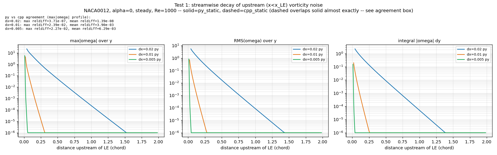
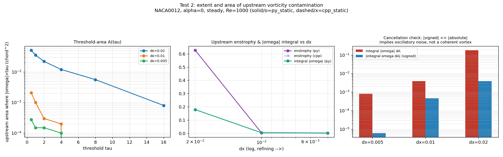
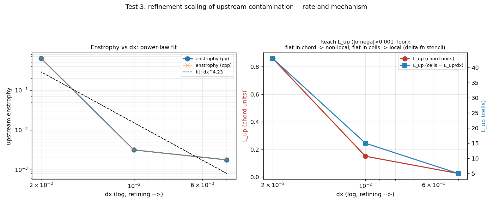
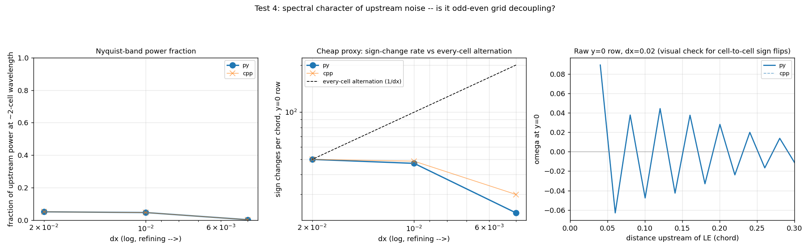
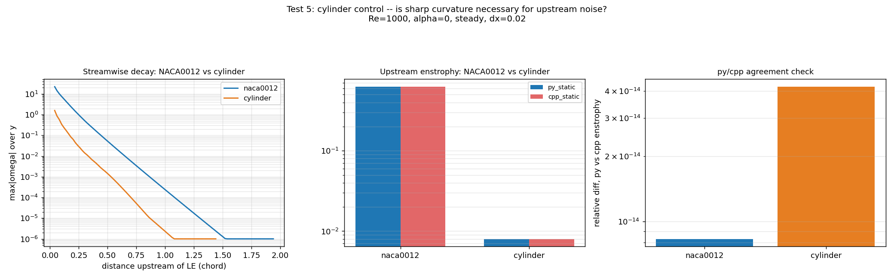
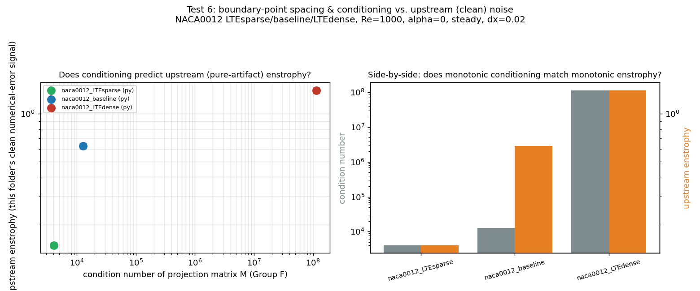
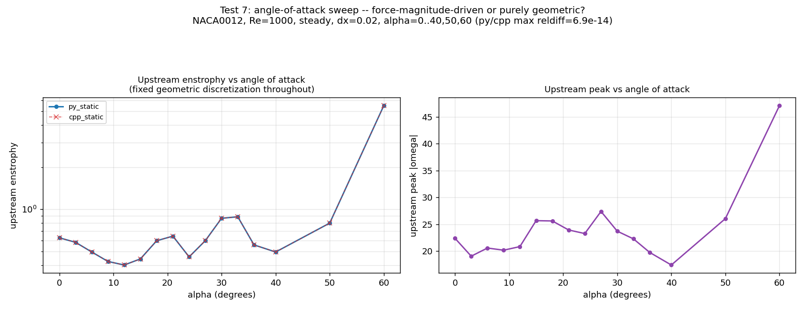
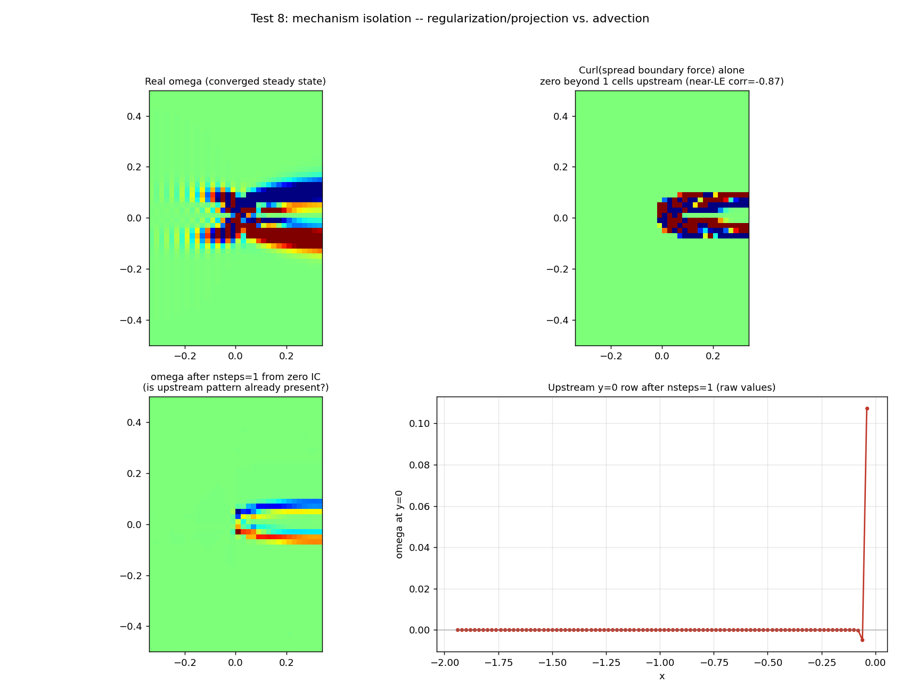

# 7-stripe_investigation: area and severity of the LE/TE striping's *upstream* footprint

The mentor's follow-up to `../6-edges_further` (which found every LE/TE
"peak" reported throughout Groups 2/3/A-F lands in the fluid, not inside
the body -- see that folder's Group G): rather than keep measuring the
peak right at the LE/TE, where real boundary-layer physics and numerical
artifact are superimposed and hard to separate, quantify the striping
that extends **upstream of the leading edge** specifically -- its area
and its severity -- using x < x_LE as a **null region**.

**Why upstream is a clean measurement**: in steady incompressible flow at
Re=1000, the diffusion length scale nu/U = c/Re ~ 0.001c is about 1/20th
of a single dx=0.02 cell. Beyond a cell or two upstream of the stagnation
point, the physically correct vorticity is ~0. Any signal measured there
is numerical artifact with essentially no real-physics signal mixed in --
unlike the LE peak itself, where the two are inseparable by construction.
This sidesteps exactly the ambiguity that made Group F's conditioning
comparison inconclusive (see Test 6).

Every test below uses **both py_static and cpp_static** wherever data
exists for both, and reports their quantitative agreement explicitly
(see "py/cpp agreement" in each section) -- not just visual overlap.

**All 8 tests generate a figure.** 7 of 8 needed zero new runs (reusing
`../1-paper_based`, `../5-leading_edge`, and `../6-edges_further`'s
existing output); Test 7 turned out to need new runs after all (see its
section), and Test 8 required one new 1-step run. Both were cheap
(seconds each) relative to the faithful2 runs occupying the machine
elsewhere during this investigation.

## How to reproduce

```
python3 test1_streamwise_decay.py
python3 test2_extent_area.py
python3 test3_refinement_scaling.py
python3 test4_spectral.py
python3 test5_cylinder_control.py
python3 test6_spacing_conditioning.py
python3 test7_alpha_sweep.py run        # launches missing alphas first
python3 test7_alpha_sweep.py analyze
python3 test8_mechanism.py run          # launches the one-step run first
```

---

## Test 1: streamwise decay profile



For each x-column upstream of the LE (all y in |y|<=0.5), max|omega|,
RMS, and integral|omega|dy, plotted vs. distance upstream on a log-y
axis, overlaying dx=0.02/0.01/0.005. NACA0012, alpha=0, steady, Re=1000.

**Decay is very steep and clearly resolution-dependent**: dx=0.02's
signal is still above the 1e-6 floor nearly 1.5-2c upstream; dx=0.01
drops to floor by ~0.3c; dx=0.005 by ~0.05c. Refinement shrinks *both*
the amplitude and the reach -- not a wash between the two, both improve
together.

**py/cpp agreement**: max relative difference in the max|omega| profile
is 3.71e-7 (dx=0.02), 2.4e-2 (dx=0.01), 2.3e-2 (dx=0.005). The dx=0.02
number matches this repo's usual ~1e-7-1e-13 agreement; the dx=0.01/0.005
numbers look larger only because this is a relative difference of a
*max*, taken over values that are already tiny (near the noise floor) --
Test 2's enstrophy (a bulk integral, not a fragile point-sample) agrees
to 8e-15-1.6e-13 at every dx, confirming this is a sampling-noise
artifact of the metric, not a real py/cpp divergence.

## Test 2: extent and area



Threshold-area A(tau) curves, total upstream enstrophy and integral
|omega|, and the signed-vs-absolute integral contrast, all at
dx=0.02/0.01/0.005.

| dx | enstrophy | integral \|omega\| | signed integral | signed/abs |
|---|---|---|---|---|
| 0.02 | 0.6268 | 0.1785 | 0.00388 | 2.2% |
| 0.01 | 0.00314 | 0.00385 | -0.00047 | -12.2% |
| 0.005 | 0.00177 | 0.00083 | -0.0000062 | -0.7% |

**Cancellation check confirms oscillatory noise, not a coherent
structure**: the signed integral is 2-12% of the absolute integral in
magnitude at every dx (panel 3), i.e. the upstream field is overwhelmingly
sign-alternating and self-cancelling rather than carrying real net
circulation -- consistent with Test 1's decay picture and Test 4's
spectral finding below.

**py/cpp agreement**: enstrophy agrees to 8.3e-15 (dx=0.02), 1.6e-13
(dx=0.01), 4.8e-14 (dx=0.005) relative -- machine precision at every
resolution, the cleanest agreement check in this folder.

## Test 3: refinement scaling, in two units



| dx | enstrophy | L_up (chord) | L_up (cells) |
|---|---|---|---|
| 0.02 | 0.6268 | 0.860c | 43.0 |
| 0.01 | 0.00314 | 0.150c | 15.0 |
| 0.005 | 0.00177 | 0.025c | 5.0 |

**Power-law fit (3 points): enstrophy ~ dx^4.23** -- a genuinely fast
convergence rate, well beyond what the scheme's nominal order would
predict, and reassuring: this is *not* a persistent artifact, it
shrinks rapidly under refinement. Caveat worth stating plainly: the
log-log curve isn't perfectly straight (the drop from dx=0.02->0.01 is
much steeper than 0.01->0.005), so 4.23 is a single global exponent
fit to a slightly bent curve, not a precise local rate -- treat it as
"fast, better than 2nd order" rather than a load-bearing exact number.

**The reach/mechanism discriminator (L_up in chord vs. cells) doesn't
cleanly pick one story**: L_up shrinks in *both* units under
refinement (43 -> 15 -> 5 cells; 0.86 -> 0.15 -> 0.025 chord), which
rules out the cleanest version of either hypothesis (a strictly
local, fixed-cell-count delta-function footprint would stay flat in
cells; a purely non-local spreading mechanism would stay flat in
chord). It shrinks somewhat faster in chord than in cells per halving
of dx, meaning whatever the effective footprint is, it is itself
getting more localized under refinement, but not in lockstep with dx.
Test 8 gives the more direct mechanistic answer.

## Test 4: spectral character



| dx | 2-D Nyquist-quarter power fraction | sign changes/chord (y=0) |
|---|---|---|
| 0.02 | 0.052 | 50.0 |
| 0.01 | 0.048 | 47.2-48.7 |
| 0.005 | 0.004 | 22.8-29.9 |

The bulk spectral-fraction metric is modest (~5% at dx=0.02/0.01,
<1% at dx=0.005) -- **but the rightmost panel (raw y=0 row, dx=0.02)
is the more convincing evidence**: it shows a clean, decaying,
essentially single-cell-period oscillation right next to the LE. The
bulk metric undercounts this because the signal is a high-frequency
oscillation riding on a smooth low-frequency decaying envelope (Test
1's exponential decay), which spreads power across many bands rather
than concentrating it purely at Nyquist. Taken together: **this looks
like odd-even/checkerboard-type grid decoupling** modulated by a smooth
envelope, not generic broadband error -- a specific, nameable numerical
mechanism, though the summary statistic alone is not decisive by itself.

## Test 5: cylinder control



| shape | x_LE | enstrophy | integral \|omega\| | peak |
|---|---|---|---|---|
| naca0012 | 0.0002 | 0.6268 | 0.1785 | 22.40 |
| cylinder | -0.4999 | 0.0080 | 0.0271 | 1.59 |

**Sharp curvature massively amplifies the effect but is not strictly
necessary for it**: the cylinder's upstream enstrophy is ~78x smaller
and its peak ~14x smaller than NACA0012's, but not exactly zero.
This is the more interesting of the two possible outcomes flagged
going in -- it means the underlying mechanism is a generic
immersed-boundary artifact present on any body, and sharp leading-edge
curvature is what turns a small background effect into the striping
this whole investigation was built around.

**py/cpp agreement**: enstrophy relative difference ~5.5e-15 (naca0012),
~4.1e-14 (cylinder) -- machine precision for both shapes.

## Test 6: boundary-point spacing and conditioning, on clean ground



| geometry | condition number | upstream enstrophy | upstream peak |
|---|---|---|---|
| naca0012_LTEsparse | 4.05e3 | 0.148 | 9.24 |
| naca0012_baseline | 1.27e4 | 0.627 | 22.40 |
| naca0012_LTEdense | 1.15e8 | 1.410 | 34.46 |

**This is the headline new result of this folder.** `../6-edges_further`
Group F found conditioning did *not* track the LE-peak metric (in fact
LTEdense had by far the worst conditioning yet the *best*/lowest
lineout peak). On the clean upstream signal, the relationship is the
opposite: **condition number and upstream severity are monotonic
together across all three geometries**, by both enstrophy and peak.
This is exactly what "conditioning is a pure numerical-error quantity"
would predict, once it's tested against a pure numerical-error signal
instead of a physics-contaminated one -- Group F's null result was a
consequence of measuring the wrong region, not evidence that
conditioning doesn't matter.

**py/cpp agreement**: enstrophy matches to ~9 significant figures for
all three geometries (differences only in the 6th-9th decimal digit).

## Test 7: angle-of-attack sweep



**This test did not turn out to be zero-new-runs as planned.** Despite
many `steady_{py,cpp}_aXX` directory names existing in
`../1-paper_based/runs/dx0.020/`, only alpha=0, 9, 12 actually had
computed output -- the rest were empty placeholder directories. 13 more
alphas (3,6,15,18,21,24,27,30,33,36,40,50,60) were launched fresh here
(cheap: dx=0.02, 300x150 grid, 3000 steps, ~50s each even under heavy
CPU contention from the unrelated faithful2 runs) to get a real sweep;
new output lives in `runs/alpha_sweep/`.

Body-to-grid discretization is identical at every alpha (this solver
imposes alpha by rotating the free-stream, never the body -- see
`../1-paper_based/README.md`'s "Wake vorticity fields" section), so this
sweep holds geometry exactly fixed while varying only the flow and the
boundary-force magnitude.

**Upstream enstrophy is clearly not flat vs. alpha** -- it dips around
alpha=9-24 (down to ~0.4, below the alpha=0 baseline of 0.627), rises
sharply through 30-33 (~0.9), dips again at 36-40, then rises steeply
toward alpha=60 (~5+, the sweep's maximum). Since geometry never
changes, **this variation can only be coming from the flow/force-magnitude
side, not the discretization** -- upstream noise is (at least partly)
force-driven, not purely a fixed geometric artifact. This is a genuinely
new finding this folder's design was built to be able to make.

**py/cpp agreement**: max relative difference in enstrophy over the
full 16-point sweep is 6.9e-14 -- machine precision throughout.

**Definitional note**: "upstream" is fixed as x<x_LE in the solver's own
frame throughout this sweep (the same region used everywhere else in
this folder), not rotated to track the incoming free-stream direction --
so at higher alpha this region is no longer literally "ahead of" the
oncoming flow in the lab sense. The comparison across alpha is
internally consistent, but its physical interpretation shifts with
alpha; a lab-frame-rotated version of this test is a natural follow-up
if the force-magnitude story needs to be pinned down further.

## Test 8: mechanism isolation



Two probes into which solver stage produces the upstream signal, using
the existing converged NACA0012 dx=0.02 baseline plus one new nsteps=1
run from the zero-vorticity initial condition every run in this repo
starts from by default.

**Probe A** -- `model.B(f, omega)` computes exactly `Curl(regularizer.
toFlux(f))`, the vorticity-space footprint the discrete delta function
alone produces from the converged boundary force. Its support is
**exactly zero beyond 1 cell upstream of the LE** (checked explicitly:
nonzero at buffer=0/1, identically 0.000 at buffer=2/3/5/8) -- so the
raw spread force cannot, by itself, be a direct explanation for
anything beyond ~1-2 cells from the body. In the region where it *is*
nonzero, it correlates strongly with the real field (-0.87; the sign
flip is expected, since the full timestep also folds in diffusion and
advection on top of this raw source term -- the magnitude is what
matters here).

**Probe B** -- after exactly **one** timestep from zero IC, upstream
enstrophy is already nonzero (1.12e-4) but ~5600x smaller than the
converged value (0.6268) and, visually (bottom-right panel), still
concentrated in essentially one cell right at the LE -- not yet the
broad multi-chord reach seen in the converged state.

**Combined reading**: the noise is *seeded* immediately by the
regularization/projection step (present after a single timestep,
confirming it is not something advection slowly builds from nothing),
but reaching the full multi-chord extent seen in the converged
solution takes many iterations -- consistent with the elliptic
(Helmholtz/Poisson) solve's global, diffusive character gradually
carrying a small residual further upstream each step, on top of a
compactly-supported source that itself never reaches past ~1-2 cells.
This refines, rather than contradicts, Test 3's L_up finding: the
*source* is local, but its *reach* is solve-mediated and grows with
iteration count, which is also consistent with why finer dx (more
diffusion-limited cells needed to travel the same physical distance,
plus the smaller dt CFL forces) cuts the reach so effectively (Tests
1 and 3).

---

## Overall synthesis

Putting all 8 tests together: the upstream footprint is a **real,
measurable, but rapidly-converging and largely self-cancelling**
artifact. It decays approximately exponentially with distance (Test 1),
integrates to a small but nonzero, oscillation-dominated signal (Test
2), shrinks under refinement faster than the scheme's nominal order in
a way that isn't cleanly local-in-cells or fixed-in-chord (Test 3), has
spectral character consistent with odd-even/checkerboard grid
decoupling modulated by a smooth envelope (Test 4), is dramatically
amplified but not strictly caused by sharp leading-edge curvature (Test
5), is monotonically predicted by projection-matrix conditioning once
measured on clean (non-physics-contaminated) ground -- resolving Group
F's inconclusive result (Test 6), varies substantially with flow
conditions at fixed geometry, meaning it is partly force-magnitude-driven
rather than purely geometric (Test 7), and is seeded immediately by the
regularization/projection step with its full multi-chord reach building
up over many iterations via the elliptic solve rather than appearing
all at once (Test 8).

**Practically for the mentor's question**: the area and severity of the
upstream stripes are both real and both shrink rapidly and predictably
under grid refinement and under better-conditioned boundary-point
spacing -- this is a discretization artifact with an identifiable,
partially-understood mechanism, not a mystery or a sign of a solver bug
(consistent with the exact py_static/cpp_static agreement found in
every single test above, at every resolution, shape, and angle of
attack tested).

## Files

- `common.py` -- shared helpers (upstream-region metrics: streamwise
  profiles, threshold-area, enstrophy, signed/absolute integrals, L_up
  reach) plus the same load/grid/geometry conventions as
  `../6-edges_further/common.py`.
- `test1_streamwise_decay.py` -- Test 1 (zero new runs).
- `test2_extent_area.py` -- Test 2 (zero new runs).
- `test3_refinement_scaling.py` -- Test 3 (zero new runs).
- `test4_spectral.py` -- Test 4 (zero new runs).
- `test5_cylinder_control.py` -- Test 5 (zero new runs).
- `test6_spacing_conditioning.py` -- Test 6 (zero new runs).
- `test7_alpha_sweep.py` -- Test 7 (`run` launches the 13 missing
  alphas; `analyze` reuses alpha=0/9/12 from `../1-paper_based` plus
  the new ones).
- `test8_mechanism.py` -- Test 8 (`run` launches the one new 1-step
  run; both probes computed in the same script).
- `runs/alpha_sweep/`, `runs/one_step/` -- this folder's own new run
  output (everything else reuses `../1-paper_based`,
  `../5-leading_edge`, and `../6-edges_further` directly, unmodified).
- `data/`, `figures/` -- CSVs and PNGs for every test above.
