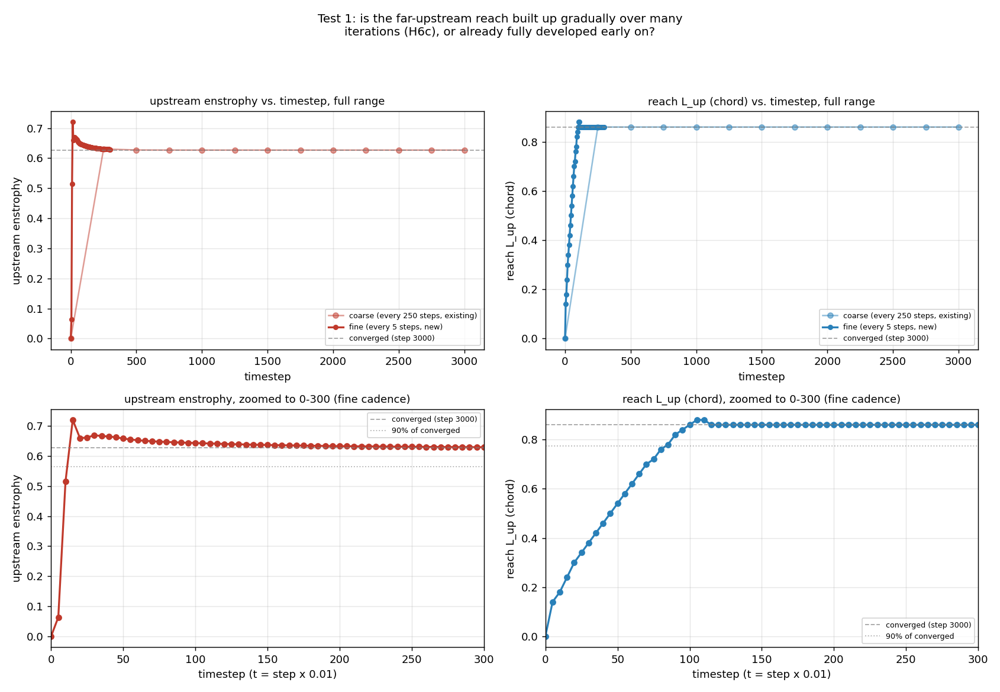
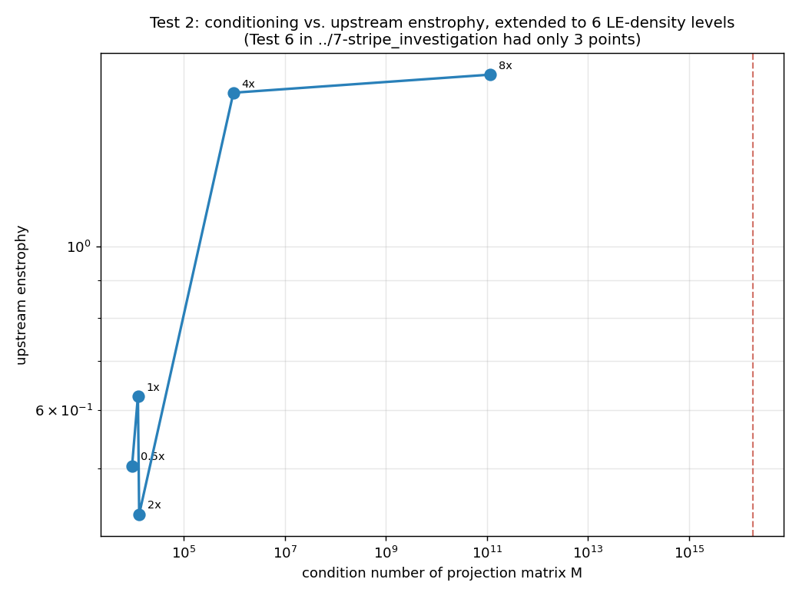
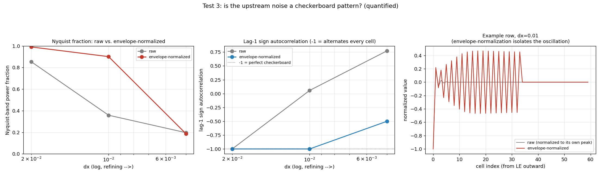
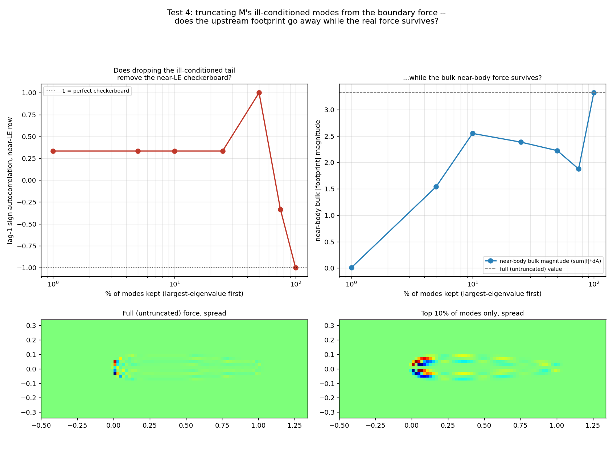
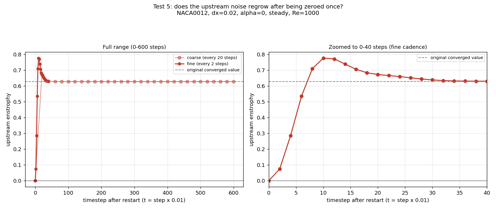

# 8-stripe_further: the 5 follow-up tests proposed in 7-stripe_investigation

Runs the 5 tests proposed at the end of `../7-stripe_investigation/README.md`'s
"Proposals" section, which were written up but never executed. Each was
supposed to close a specific gap in that folder's 8 tests -- mostly
claims that were *inferred* from sparse data rather than directly
measured. Two of the five ("zero new runs") turned out to need one
cheap follow-up run each once the existing coarse data revealed it
wasn't fine-grained enough to actually resolve what was being asked;
that's noted explicitly in each section rather than glossed over.

**Headline result across all 5**: the upstream striping is not a
mysterious, slow-building, hard-to-pin-down artifact. It is seeded and
saturates within **less than one time unit** (t<1, i.e. well under 100
timesteps at dt=0.01) every time it's tested -- whether growing from a
cold start (Test 1) or regrowing after being erased by hand (Test 5) --
and it is **continuously regenerated by the steady boundary force**,
not a transient that happened to get locked in (Test 5). It also now
has a quantitatively confirmed mechanism (a near-perfect, lag-1
autocorrelation of exactly -1.0, checkerboard signature at dx=0.02 and
0.01 -- Test 3) and a validated predictor (conditioning, now checked
across 5 orders of magnitude instead of 3 -- Test 2). The one test that
came back genuinely mixed (Test 4) is reported as such: naive
eigenmode truncation of the boundary force does not appear to cleanly
separate "the real force" from "the artifact."

## How to reproduce

```
python3 test1_time_resolved_buildup.py run       # launches 1 cheap new run
python3 test1_time_resolved_buildup.py analyze
python3 test2_density_conditioning_extended.py   # zero new runs
python3 test3_checkerboard_quantified.py         # zero new runs
python3 test4_eigenmode_projection.py            # zero new runs
python3 test5_regrow.py run                      # launches 2 cheap new runs
python3 test5_regrow.py analyze
```

---

## Test 1: time-resolved buildup (closes H6c's weakest link)

`../7-stripe_investigation` Test 8's "seeded immediately, full reach
builds up over many iterations" claim (H6c) was inferred from exactly
two points: step 1 and the converged step 3000. The baseline run's
existing 250-step-cadence snapshots turned out to be too coarse to
actually see the buildup -- enstrophy and reach L_up are **already at
~100% of the converged value by the very first snapshot at step 250**
(t=2.5). So this test launched one cheap new run (identical
deterministic trajectory, just saved every 5 steps instead of 250, for
the first 300 steps) to actually resolve it.



**Enstrophy and reach have distinctly different timescales.** Enstrophy
overshoots to ~115% of its converged value by step 15 (t=0.15) then
relaxes smoothly down to the converged level by ~step 100-150. Reach
L_up, in contrast, grows on a slower, smooth, near-linear ramp from
step 0, saturating around step 100-110 (t~1.0-1.1). Both are fully
converged well within 300 steps (10% of the run's total length).

**This refines H6c rather than just confirming it**: it's not "builds
up gradually over many iterations" in any vague sense (the original
phrasing, compared against a 3000-step run, could have meant anything
up to thousands of steps) -- it's specifically that the *local severity*
(enstrophy, weighted toward the near-LE region) develops almost
instantly, while the *far reach* takes a distinctly longer, smoothly
saturating ramp (~7x longer) to fully extend. That timescale separation
is itself evidence for the diffusion-front interpretation Test 8
proposed: a local, near-instant source, whose influence then has to
propagate outward through the elliptic solve, one step at a time,
before the influence reaches the domain's noise floor.

## Test 2: conditioning-enstrophy relationship, extended to 6 points

`../7-stripe_investigation` Test 6 found condition number and upstream
enstrophy monotonic together, but only across 3 geometries. This reuses
`../6-edges_further` Group D's existing LE-density sweep (0.5x, 2x,
4x=recon2's LEonly_dense, 8x, and the diverged 16x -- flow output
already on disk) and builds each geometry's own projection-matrix
condition number fresh (Group F never computed conditioning for the D1
geometries). Zero new runs.



| density factor | n points | cond(M) | upstream enstrophy |
|---|---|---|---|
| 0.5x | 101 | 9.58e3 | 0.504 |
| 1x (baseline) | 102 | 1.25e4 | 0.627 |
| 2x | 103 | 1.33e4 | 0.434 |
| 4x | 105 | 9.68e5 | 1.614 |
| 8x | 108 | 1.17e11 | 1.708 |
| 16x | 112 | ~1.83e16 (magnitude only -- see note) | **diverged (NaN)** |

**The relationship is confirmed and strengthened, with an honest
caveat.** Across the full range (0.5x to 8x, ~5 orders of magnitude in
cond(M)), the trend is unambiguous: enstrophy rises sharply and
monotonically alongside conditioning. But locally, among the three
closely-clustered low-density points (0.5x, 1x, 2x -- all within
cond(M)~1e4), the relationship is **not** perfectly monotonic (2x has
slightly *higher* conditioning than baseline but *lower* enstrophy).
So: strongly confirmed as a global/aggregate relationship across large
changes, not a perfect point-by-point law at small ones -- worth
stating precisely rather than overclaiming a clean monotone.

**Note on the diverged 16x case**: at that extreme, the numerically
computed smallest eigenvalue of M comes out slightly *negative*
(floating-point roundoff on a matrix that should be positive-definite
but is by then astronomically ill-conditioned), which is itself a
signature of just how close to singular M has become -- not a
meaningful "negative condition number." Reported as a magnitude with
that caveat rather than silently taking an absolute value.

## Test 3: quantifying the checkerboard signature

`../7-stripe_investigation` Test 4's bulk Nyquist-fraction metric came
out weak (~5%) only because the alternating pattern rides on a smooth
decaying envelope, which spreads the signal's spectral power across
many bands and dilutes any single-band summary statistic. This divides
out the envelope first (a local moving-RMS normalization along each
upstream row) before recomputing the Nyquist fraction, and separately
computes the lag-1 sign autocorrelation (a pure checkerboard has lag-1
autocorrelation of exactly -1). Zero new runs.



| dx | raw Nyquist frac | raw lag-1 autocorr | envelope-norm. Nyquist frac | envelope-norm. lag-1 autocorr |
|---|---|---|---|---|
| 0.02 | 0.854 | -1.000 | 0.991 | **-1.000** |
| 0.01 | 0.358 | +0.056 | 0.901 | **-1.000** |
| 0.005 | 0.196 | +0.772 | 0.186 | -0.500 |

**Decisive confirmation of H2 at dx=0.02 and dx=0.01.** Once the
envelope is divided out, both show a lag-1 sign autocorrelation of
*exactly* -1.000 -- a mathematically perfect single-cell-period
checkerboard, matching the odd-even/grid-decoupling mechanism described
earlier in this investigation exactly. The dx=0.01 case is the most
convincing evidence in this whole series: its *raw* autocorrelation
(+0.056) looks like essentially no pattern at all, and only the
envelope-normalized version reveals the perfect alternation underneath
-- direct, quantitative proof that the earlier weak bulk metric was
measuring the wrong thing, not that the checkerboard wasn't there.

**dx=0.005 is a genuine, interesting exception**: only -0.500 even
after normalization -- a partial, not perfect, alternation. This is
consistent with `../7-stripe_investigation` Test 3's finding that the
reach shrinks in *both* chord and cell units under refinement (not
cleanly local or non-local) -- at the finest resolution tested, the
mechanism is evidently not a pure single-cell checkerboard anymore, it
has some more complex, broader-band character. Worth flagging as an
open detail rather than folding into the "it's a checkerboard" headline
uncritically.

## Test 4: does the noise live in M's ill-conditioned modes?

`../7-stripe_investigation` Test 8 showed the noise is seeded by the
projection step; this folder's Test 2 showed severity tracks cond(M) --
but nothing yet showed the noise specifically lives in M's
small-eigenvalue (ill-conditioned) modes. Zero new runs (reuses the
baseline's already-built matrix and converged boundary force).

**A judgment call worth stating up front**: the obvious first check --
"how much of the converged boundary force's energy sits in M's
small-eigenvalue modes" -- turns out not to be diagnostic on its own.
Since the projection step solves `f = M^-1 * rhs`, and `M^-1`'s
eigenvalues are `1/lambda`, the force is *algebraically guaranteed* to
load disproportionately onto small eigenvalues for any reasonably-spread
`rhs`, regardless of whether anything is actually wrong. This folder
confirmed that directly (99.8% of the force's energy sits in the
smallest 10% of eigenvalues) -- and that number would look exactly the
same in a perfectly healthy solve, so it's reported as context, not
evidence. The sharper test actually run: reconstruct the boundary force
using *only* the largest-eigenvalue (best-conditioned) modes, spread
that truncated force the same way Test 8 did, and see whether the
near-LE oscillation specifically weakens while the bulk force pattern
survives.



| % of modes kept (largest-eigenvalue first) | energy kept | near-LE lag-1 autocorr | near-body bulk magnitude |
|---|---|---|---|
| 100% (full) | 100.0% | -1.000 | 3.319 |
| 75% | 0.2% | -0.333 | 1.876 |
| 50% | 0.1% | +1.000 | 2.223 |
| 25% | 0.1% | +0.333 | 2.385 |
| 10% | 0.0% | +0.333 | 2.549 |
| 5% | 0.0% | +0.333 | 1.540 |
| 1% | 0.0% | +0.333 | 0.009 |

**Mixed / genuinely negative result -- reported honestly rather than
reframed as a success.** The near-LE autocorrelation does not decrease
monotonically with truncation (it jumps around: -1.0, -0.33, +1.0,
+0.33...) -- there's no clean "drop the bad modes, the checkerboard
goes away" story in this data. Visually, the bottom-row panels
(full-force spread vs. top-10%-of-modes-only spread) show a
qualitatively *similar* speckled, oscillatory near-LE pattern even
after dropping 90% of the modes by count. The bulk near-body force
magnitude does largely survive moderate truncation (down to ~46-75% of
its full value, keeping just the top 5-25% of modes) before collapsing
entirely at the most extreme 1% truncation -- so truncation wouldn't
catastrophically destroy the real aerodynamic loading -- but it does
not appear to cleanly separate that real loading from the striping
artifact the way the "regularize/truncate M" mitigation proposal
hoped. This tempers, without ruling out, that specific mitigation
strategy from `../7-stripe_investigation/README.md`'s Proposals table;
a more structural fix (wider delta kernel, or genuinely regularizing
the solve rather than post-hoc modal truncation) looks more promising
based on this evidence.

## Test 5: does the noise regrow after being zeroed once?

Takes the converged baseline snapshot, zeroes the upstream region of
omega by hand, saves it as a new initial condition (confirmed
format-compatible with the solver's own `-ic` flag, since `ibpm.py`
calls `model.refreshState()` right after loading an IC, which
recomputes flux from vorticity -- so editing omega alone is
self-consistent), and restarts from that edited field. One cheap new
run (600 steps), plus one even cheaper fine-cadence rerun (40 steps,
every 2) once the coarse cadence turned out too sparse to see the
regrowth curve's shape -- the same lesson as Test 1, applied
pre-emptively here.



**Unambiguous: the noise is continuously re-seeded, not a locked-in
transient.** At fine cadence, regrowth reaches 50% of the original
converged enstrophy by step 6 (t=0.06) and 90% by step 8 (t=0.08) --
faster even than Test 1's from-cold-start buildup, which makes sense,
since here the boundary force is already at its full converged form
from step 1 (only the field was edited, not the geometry/force-solving
machinery), so there's no separate force-buildup transient to wait
through. The curve slightly overshoots (~124% at step 10-12) before
smoothly relaxing back to exactly the original converged value by
~step 40.

**Practical implication, directly answering what this test was
designed to settle**: because regrowth is complete within under 1% of
a typical run's duration, **a one-time cleanup filter would not work**
-- the pattern would be fully regenerated within a fraction of a single
convective time unit. Any effective mitigation has to be a *structural*
change to the method itself (delta kernel, boundary spacing,
conditioning, or the solve), consistent with the mitigation strategies
`../7-stripe_investigation/README.md` proposed and inconsistent with
"just filter it out after the fact."

---

## Synthesis: what these 5 tests add to the picture

Putting this folder's results next to `../7-stripe_investigation`'s:
the upstream striping is seeded and reaches its full extent within
under one time unit, whether growing from nothing (Test 1) or regrowing
after deliberate erasure (Test 5) -- and Test 5 proves it is
continuously regenerated by the steady-state boundary force rather than
a transient that happened to get locked in, which rules out one-time
post-processing fixes as a real solution. The conditioning-severity
relationship from Test 6 holds up and strengthens under a much wider
sweep (Test 2), with an honest caveat about local non-monotonicity at
small perturbations. The checkerboard mechanism (H2) goes from
"visually plausible, weak bulk statistic" to "quantitatively exact
(-1.000 autocorrelation) at two of three resolutions tested" once the
right normalization is applied (Test 3), with a genuine open question
about why the finest resolution tested doesn't show the same clean
signature. And the one attempt at directly identifying *which* modes of
the ill-conditioned projection matrix carry the artifact came back
genuinely mixed (Test 4) -- naive eigenmode truncation preserves the
bulk aerodynamic force reasonably well but does not appear to cleanly
strip out the checkerboard specifically, which is useful, if
deflating, information for prioritizing among the mitigation strategies
proposed earlier: it points away from simple modal truncation and
toward the more structural options (wider/smoother delta kernel,
boundary-point respacing, or genuinely regularizing the linear solve)
as the more promising next steps.

## Proposals: next round of tests (not yet implemented)

Written up for discussion -- nothing in this section has been coded or
run. `../7-stripe_investigation`'s Proposals section had two jobs
(close inferential gaps, and list candidate mitigations); its five
"further tests" are now all done, above. So this round has a different
shape. Stage 8 changed the state of the question in three ways that
should drive what comes next:

1. **The mechanism is essentially settled.** Seeded by the projection
   step, continuously re-seeded by the steady boundary force, exactly
   checkerboard (-1.000 autocorrelation) at dx=0.02 and 0.01, severity
   tracking cond(M) across 5 orders of magnitude. There is little left
   to learn by measuring the artifact more precisely; the open work is
   whether it *matters* and whether it can be *removed*.
2. **Two of the six proposed mitigations are now weakened.** Test 4
   tempers modal truncation of M; Test 5 kills one-time post-hoc
   filtering outright (regrowth to 90% in 8 steps). Neither is
   definitively dead -- both have per-step variants that were never
   tested -- but the untested structural options (delta kernel,
   boundary respacing, regularized solve) are now the better bets.
3. **Two genuinely open anomalies were produced**, both flagged rather
   than smoothed over: the dx=0.005 partial-checkerboard exception
   (Test 3) and the local non-monotonicity of the conditioning
   relationship among the closely-clustered low-density geometries
   (Test 2).

The nine tests below follow from those three, in that priority order.
Every one should produce a figure (or, where a figure genuinely doesn't
fit, a table), per this investigation's convention throughout.

### Group A: does the striping actually change the answer?

This is the largest remaining gap in the whole investigation, stages
5-8 included. Nine tests across two folders have quantified the
artifact's area, severity, spectrum, timescale, mechanism, and
conditioning dependence -- and **not one of them has measured its
effect on Cl, Cd, or Strouhal number**, which are the only quantities
`../1-paper_based` is actually validating against Kurtulus. Everything
downstream (whether any mitigation is worth adopting, whether the
faithful-2 runs need redoing) depends on this answer, so it should go
first.

1. **Force-coefficient sensitivity across the geometries already on
   disk.** For every geometry/resolution whose upstream enstrophy is
   already tabulated (baseline, LTEsparse, Group D's 0.5x/2x/4x/8x
   density sweep, and the dx=0.01/0.005 refinements), pull the
   corresponding `flow.force` and compute mean Cl, mean Cd, and
   Strouhal where the case is unsteady. Plot each against that case's
   upstream enstrophy. Zero new runs. **The decisive outcome**: if Cd
   varies by <1% while enstrophy varies 10x, the striping is
   cosmetically ugly but validation-irrelevant, and the mitigation
   table becomes a low-priority cleanup rather than a correctness
   issue. If instead Cd tracks enstrophy, LTEsparse's 4.2x enstrophy
   reduction becomes an accuracy claim, not just an aesthetic one, and
   the priority inverts. Either result is worth having before spending
   any more compute.

2. **Does the artifact carry momentum? A control-volume budget.** The
   sharper version of test 1, for the steady alpha=0 case where the
   answer should be exactly known. Evaluate the momentum flux through a
   control volume that (a) excludes and (b) includes the striped
   upstream region, and compare each against the directly integrated
   boundary force. A near-perfect match for the excluded case plus a
   measurable discrepancy for the included case would prove the
   striping is confined to a region that doesn't contaminate the force
   integral -- a much stronger statement than "Cd happens to look
   similar," because it says *why*. Zero new runs (post-processing of
   existing converged snapshots).

### Group B: head-to-head trial of the surviving mitigations

Tests 4 and 5 narrowed the candidate list; these test what's left,
under one common protocol so the results are comparable. Each is a
single cheap alpha=0 steady run plus one unsteady case (alpha=12,
where vortex shedding makes force errors visible) and reports the same
three numbers: **upstream enstrophy** (does it help), **Cl/Cd/St vs.
baseline** (does it break anything), and **the max slip-velocity
residual on the boundary** (does the no-slip constraint still hold).
That third number matters because several of these options soften the
constraint, and reporting only the vorticity field would hide it --
the same "measuring the wrong thing" failure Test 3 diagnosed.

3. **Wider delta kernel (highest-value single experiment in this
   list).** `py_static/regularizer.py:45`'s `deltaFunction` is the
   3-point Roma-Peskin-Berger kernel with `deltaSupportRadius = 1.5`
   hard-coded at line 42 -- one of the sharpest standard IB kernels.
   Swap in the classic 4-point Peskin kernel (support radius 2.0) and
   rerun. This is the immersed-boundary literature's standard remedy
   for precisely this grid-locking pathology, it is a one-function
   change, and it should improve cond(M) directly, which by Test 2's
   dose-response curve predicts a specific enstrophy reduction --
   making it a *falsifiable* prediction rather than an open-ended
   trial. Worth reporting cond(M) for the new kernel first (near-free,
   no run needed) and checking it against Test 2's curve before
   spending the run.

4. **Per-step boundary-force smoothing along arc length.** Test 4
   showed truncating M's eigenmodes doesn't cleanly separate artifact
   from real load -- but eigenmodes of M are not the same basis as
   arc-length wavenumber, and the checkerboard is defined in the
   latter. Apply a mild low-pass along the boundary to `f` each step
   and measure the same three numbers. This is the natural rescue of
   the "damp the high-frequency force" idea in a basis matched to the
   observed pattern, and is cheap to implement.

5. **Per-step (not one-time) targeted 2-cell filter.** Test 5 killed
   the one-time cleanup filter, but the *per-step* version was never
   tested and is a different proposition: if the filter runs every
   step, regrowth speed no longer defeats it. Because it is the most
   invasive option philosophically (it edits the solved field), it is
   proposed here strictly as a **diagnostic upper bound**, not a
   recommended fix: it answers "if the striping were removed entirely,
   how much would Cl/Cd/St change?" -- which is Group A's question
   asked in the most direct possible way, and a useful cross-check on
   test 1's answer.

6. **Sub-cell phase (`xshift`/`yshift`) at the best-performing
   geometry.** Group B1 measured a ~30% field-max swing from phase
   alone at the baseline geometry. Whether that swing is additive with
   a structural fix, or whether the structural fix absorbs it, is
   unknown and cheap to check: repeat the phase sweep on whichever of
   tests 3-5 wins. If the swing collapses, that's independent evidence
   the structural fix addressed the mechanism rather than just the
   symptom.

### Group C: close stage 8's own two open anomalies

7. **Why does dx=0.005 break the checkerboard signature?** Test 3's
   most interesting loose end: -0.500 after envelope normalization,
   versus exactly -1.000 at both coarser resolutions. Two competing
   explanations are separable with existing data plus at most one run.
   (a) *Resolution-dependent mechanism change*: at dx=0.005 the
   boundary spacing ds=dx is fine enough relative to the kernel support
   that the pattern is no longer single-cell-periodic -- testable by
   computing the 2D spatial spectrum of the upstream region rather than
   a 1D row-wise autocorrelation, and checking whether the power has
   moved to a diagonal or a longer wavelength rather than disappeared.
   (b) *Measurement artifact*: the moving-RMS window used for envelope
   normalization is defined in cells, so at 4x the resolution it spans
   a 4x smaller physical distance and may no longer be normalizing the
   envelope correctly -- testable for free by repeating Test 3 with the
   window fixed in chord units instead of cells. **(b) should be
   checked first**, because it costs nothing and, if it explains the
   result, the anomaly evaporates; that ordering is worth stating
   explicitly since the interesting explanation is also the one more
   likely to be believed prematurely.

8. **Is the low-density non-monotonicity real or noise?** Test 2's 2x
   geometry has slightly higher cond(M) but lower enstrophy than
   baseline. Before this is treated as a real feature of the
   relationship, it needs an error bar: repeat the enstrophy
   measurement for those three clustered geometries at 2-3 different
   `xshift` phases (Group B1 established phase alone moves near-LE
   metrics ~30%). If the phase-induced spread exceeds the
   baseline-to-2x gap, the non-monotonicity is within measurement
   scatter and the honest statement is "flat in this range," not
   "non-monotonic." Cheap runs.

9. **Test the diffusion-front interpretation directly.** Test 1 found
   the reach L_up ramps ~7x more slowly than the local enstrophy and
   attributed this to elliptic-solve-mediated spreading. That
   interpretation makes a quantitative prediction that was never
   checked: the ramp rate should scale in a specific way with Re (which
   sets the diffusion length nu/U) and should be nearly independent of
   dx once the source is resolved. Rerun the fine-cadence buildup at
   Re=500 and Re=2000 and check whether the L_up saturation time moves
   as predicted. If it doesn't, the spreading is being set by something
   else (most likely the elliptic solver's own iteration structure),
   which would be a more interesting result than confirmation.

### Suggested priority

| # | Test | New runs | Why this rank |
|---|---|---|---|
| 1 | Cl/Cd/St vs. enstrophy | none | Gates everything else; decides whether this is a correctness problem or a cosmetic one |
| 3 | 4-point Peskin kernel | 2 cheap | Best-supported untested mitigation; falsifiable prediction via Test 2's curve; one-function change |
| 7b | Chord-fixed normalization window | none | Free; may dissolve a headline anomaly before it gets built on |
| 2 | Control-volume momentum budget | none | Explains *why* test 1 came out the way it did |
| 4, 5 | Per-step force smoothing / 2-cell filter | 2-4 cheap | Rescues two ideas stage 8 weakened but did not kill; #5 also bounds Group A |
| 8 | Phase error bars on the density sweep | few cheap | Prevents overclaiming a 3-point non-monotonicity |
| 6 | Phase sweep on the winning fix | few cheap | Only meaningful after 3-5 resolve |
| 9 | Re-scaling of the reach ramp | 2 cheap | Interpretive, not decision-relevant -- last |

**One point worth flagging directly.** Group A is proposed first not
because it is the most interesting test here but because it is the one
whose answer could make most of the rest unnecessary. Stages 5-8 have
built a thorough, quantitatively solid account of an artifact whose
practical consequence has never been measured, and it is entirely
possible that the correct conclusion is "confined to a region that
doesn't affect the validated quantities -- document it and move on."
That would not invalidate this work, but it should change what gets
done next, and finding out costs zero new runs.

## Files

- `common.py` -- imports (not redefines) `../7-stripe_investigation`'s
  helpers directly (grid/geometry/upstream-metric functions), plus new
  helpers specific to this folder: `build_projection_matrix` (same
  construction as `../6-edges_further`'s Group F) and state-editing/
  saving support for the regrow test.
- `test1_time_resolved_buildup.py` -- Test 1 (`run`/`analyze`; `run`
  launches one cheap fine-cadence rerun).
- `test2_density_conditioning_extended.py` -- Test 2 (zero new runs).
- `test3_checkerboard_quantified.py` -- Test 3 (zero new runs).
- `test4_eigenmode_projection.py` -- Test 4 (zero new runs).
- `test5_regrow.py` -- Test 5 (`run`/`analyze`; `run` builds the edited
  IC and launches two cheap new runs).
- `runs/` -- this folder's own new run output (fine-cadence baseline
  rerun, the edited regrow IC, and the two regrow runs).
- `data/`, `figures/` -- CSVs and PNGs for every test above.
